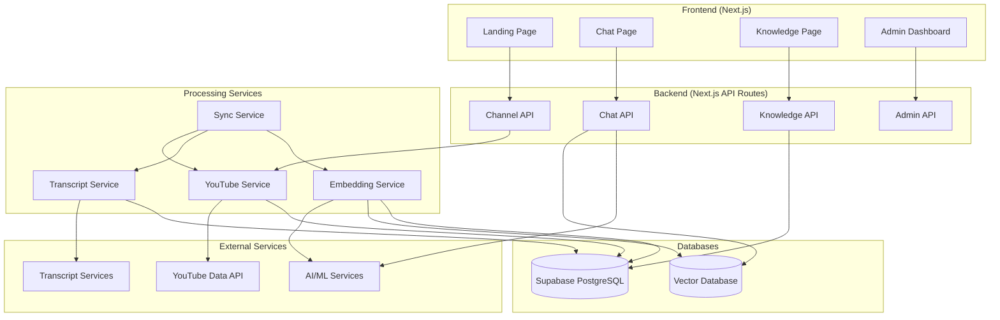

# YouTube Channel Chat App - System Architecture

## Overview

This document outlines the system architecture for the YouTube Channel Chat App, which allows users to chat with YouTube channels by querying video transcripts through an AI-powered interface.

## System Components

### 1. Frontend (Next.js Application)

The frontend is a Next.js application that provides the user interface for interacting with the system.

#### Current Structure:
- **Landing Page**: Introduction to the app with features and how it works
- **Chat Page**: Interface for selecting channels and chatting
- **About Page**: Information about the app

#### Required Enhancements:
- **Channel Selection Component**: Replace the current input field with a predefined list of available channels
- **Enhanced Chat Interface**: 
  - Display video references with timestamps
  - Deep links to specific YouTube video moments
  - Video list panel showing processed videos
- **Knowledge Page**: Display topic summaries, glossaries, and Q&A pairs
- **Admin Dashboard**: Monitor crawling, indexing, and embedding costs

### 2. Backend Services

The backend consists of several services that handle data processing, storage, and retrieval.

#### 2.1. API Service (Next.js API Routes)
- **Channel Management API**: 
  - List available channels
  - Get channel details
  - Trigger channel processing
- **Chat API**:
  - Process user queries
  - Retrieve relevant video segments
  - Generate AI responses with references
- **Knowledge API**:
  - Retrieve topic summaries
  - Get glossaries and Q&A pairs
  - Generate new knowledge artifacts

#### 2.2. Processing Service (Background Jobs)
- **YouTube Data Service**:
  - Fetch channel information
  - Retrieve video lists
  - Extract video metadata
- **Transcript Service**:
  - Download video transcripts
  - Clean and format transcripts
  - Store transcripts in database
- **Embedding Service**:
  - Convert transcripts into vector embeddings
  - Store embeddings in vector database
  - Update embeddings for new videos

#### 2.3. Synchronization Service
- **Incremental Sync**:
  - Periodically check for new videos
  - Process new videos automatically
  - Update embeddings incrementally

### 3. Database Layer

The database layer consists of both relational and vector databases.

#### 3.1. Supabase (PostgreSQL)
- **Channels Table**: Store channel information
- **Videos Table**: Store video metadata
- **Transcripts Table**: Store video transcripts
- **Conversations Table**: Store user chat conversations
- **Knowledge Table**: Store topic summaries, glossaries, and Q&A pairs
- **Processing Jobs Table**: Track background job status
- **Usage Metrics Table**: Track API usage and costs

#### 3.2. Vector Database
- **Vector Store**: Store embeddings for semantic search
- Options:
  - Supabase pgvector extension
  - Pinecone
  - ChromaDB
  - Weaviate

### 4. External Services

#### 4.1. YouTube Data API v3
- Fetch channel information
- Retrieve video lists
- Get video metadata

#### 4.2. YouTube Transcript Services
- Options:
  - YouTube API (if available)
  - Third-party transcript services
  - Web scraping with libraries like youtube-transcript-api

#### 4.3. AI/ML Services
- **Embedding Model**: Convert text to vector embeddings
  - Options: OpenAI embeddings, Cohere, or open-source models
- **LLM Service**: Generate responses to user queries
  - Options: OpenAI GPT, Anthropic Claude, or open-source models

## System Architecture Diagram

## Data Flow

1. **Channel Selection**:
   - User selects a channel from the predefined list
   - Frontend fetches channel details from Channel API
   - If channel not processed, trigger processing pipeline

2. **Processing Pipeline**:
   - YouTube Service fetches channel and video data
   - Transcript Service downloads and stores transcripts
   - Embedding Service creates vector embeddings
   - Data stored in Supabase and Vector Database

3. **Chat Interaction**:
   - User submits a question
   - Chat API converts question to embedding
   - System retrieves relevant video segments from Vector Database
   - AI service generates response with references
   - Response returned to frontend with deep links

4. **Knowledge Expansion**:
   - Conversations processed to extract knowledge
   - Topic summaries, glossaries, and Q&A pairs generated
   - Stored in Knowledge table for retrieval

5. **Incremental Sync**:
   - Sync Service periodically checks for new videos
   - New videos processed through the pipeline
   - Embeddings updated incrementally

## Security Considerations

1. **API Key Management**:
   - Store external API keys in environment variables
   - Use Supabase secrets management for sensitive data

2. **Data Validation**:
   - Validate all user inputs
   - Sanitize data before processing

3. **Rate Limiting**:
   - Implement rate limiting for API calls
   - Monitor usage to control costs

4. **Authentication**:
   - Consider user authentication for personalized experiences
   - Role-based access for admin functions

## Scalability Considerations

1. **Background Processing**:
   - Use queue systems for heavy processing tasks
   - Implement job prioritization

2. **Database Optimization**:
   - Index frequently queried fields
   - Partition large tables if needed

3. **Caching**:
   - Cache channel and video metadata
   - Cache frequent query results

4. **Load Balancing**:
   - Distribute API requests across multiple instances
   - Consider serverless functions for scalability