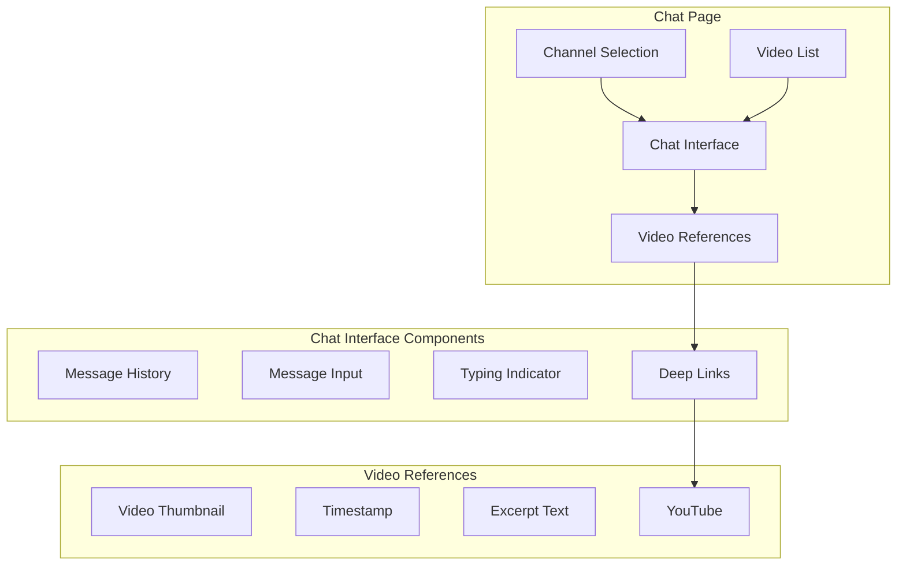

# YouTube Channel Chat App - Chat Interface with Deep Linking

This document outlines the design for the chat interface of the YouTube Channel Chat App, focusing on user experience, component structure, and deep linking to YouTube videos.

## Overview

The chat interface is the primary user interaction point where users can ask questions about YouTube channel content and receive answers with references to specific video segments. The interface includes channel selection, chat conversation display, video references with deep links, and a video list panel.

## Interface Architecture



## 1. Page Layout

### 1.1. Overall Structure

The chat page will have a responsive three-column layout on desktop and a stacked layout on mobile:

1. **Left Column** - Channel selection and video list
2. **Middle Column** - Chat interface with message history and input
3. **Right Column** - Video references and details (collapsible on mobile)

### 1.2. Responsive Design

```typescript
// Tailwind classes for responsive layout
<div className="grid grid-cols-1 lg:grid-cols-3 gap-6">
  {/* Left Column - Channel Selection & Video List */}
  <div className="lg:col-span-1">
    <ChannelSelector />
    <VideoList />
  </div>
  
  {/* Middle Column - Chat Interface */}
  <div className="lg:col-span-1">
    <ChatInterface />
  </div>
  
  {/* Right Column - Video References */}
  <div className="lg:col-span-1 hidden xl:block">
    <VideoReferences />
  </div>
</div>
```

## 2. Channel Selection Component

### 2.1. Component Design

Replace the current input field with a predefined list of available channels:

```typescript
// src/components/chat/ChannelSelector.tsx
interface Channel {
  id: string;
  title: string;
  description: string;
  thumbnailUrl: string;
  videoCount: number;
  processingStatus: 'pending' | 'processing' | 'completed' | 'error';
}

interface ChannelSelectorProps {
  channels: Channel[];
  selectedChannelId?: string;
  onChannelSelect: (channelId: string) => void;
  onChannelRefresh: (channelId: string) => void;
}

export function ChannelSelector({ 
  channels, 
  selectedChannelId, 
  onChannelSelect, 
  onChannelRefresh 
}: ChannelSelectorProps) {
  return (
    <Card>
      <CardHeader>
        <CardTitle>Available Channels</CardTitle>
        <CardDescription>
          Select a channel to start chatting
        </CardDescription>
      </CardHeader>
      <CardContent className="space-y-4">
        <div className="space-y-2 max-h-96 overflow-y-auto">
          {channels.map((channel) => (
            <ChannelCard
              key={channel.id}
              channel={channel}
              isSelected={selectedChannelId === channel.id}
              onSelect={() => onChannelSelect(channel.id)}
              onRefresh={() => onChannelRefresh(channel.id)}
            />
          ))}
        </div>
      </CardContent>
    </Card>
  );
}

interface ChannelCardProps {
  channel: Channel;
  isSelected: boolean;
  onSelect: () => void;
  onRefresh: () => void;
}

function ChannelCard({ channel, isSelected, onSelect, onRefresh }: ChannelCardProps) {
  return (
    <div 
      className={`p-3 rounded-lg border cursor-pointer transition-colors ${
        isSelected 
          ? 'border-primary bg-primary/5' 
          : 'border-border hover:bg-muted/50'
      }`}
      onClick={onSelect}
    >
      <div className="flex items-start space-x-3">
        
        <div className="flex-1 min-w-0">
          <div className="flex items-center justify-between">
            <h3 className="font-medium truncate">{channel.title}</h3>
            <ChannelStatusBadge status={channel.processingStatus} />
          </div>
          <p className="text-sm text-muted-foreground truncate">
            {channel.videoCount} videos
          </p>
        </div>
        <Button 
          variant="ghost" 
          size="icon"
          onClick={(e) => {
            e.stopPropagation();
            onRefresh();
          }}
        >
          <RefreshCw className="h-4 w-4" />
        </Button>
      </div>
    </div>
  );
}

interface ChannelStatusBadgeProps {
  status: 'pending' | 'processing' | 'completed' | 'error';
}

function ChannelStatusBadge({ status }: ChannelStatusBadgeProps) {
  const variants = {
    pending: { label: 'Pending', className: 'bg-yellow-100 text-yellow-800' },
    processing: { label: 'Processing', className: 'bg-blue-100 text-blue-800' },
    completed: { label: 'Ready', className: 'bg-green-100 text-green-800' },
    error: { label: 'Error', className: 'bg-red-100 text-red-800' },
  };
  
  const { label, className } = variants[status];
  
  return (
    <span className={`text-xs px-2 py-1 rounded-full ${className}`}>
      {label}
    </span>
  );
}
```

## 3. Video List Component

### 3.1. Component Design

Display a list of videos from the selected channel:

```typescript
// src/components/chat/VideoList.tsx
interface Video {
  id: string;
  youtubeVideoId: string;
  title: string;
  thumbnailUrl: string;
  publishedAt: string;
  duration: string;
  viewCount: number;
  transcriptStatus: 'pending' | 'available' | 'not_available' | 'error';
}

interface VideoListProps {
  videos: Video[];
  selectedVideoId?: string;
  onVideoSelect: (videoId: string) => void;
  isLoading: boolean;
}

export function VideoList({ 
  videos, 
  selectedVideoId, 
  onVideoSelect, 
  isLoading 
}: VideoListProps) {
  return (
    <Card className="mt-6">
      <CardHeader>
        <CardTitle>Videos</CardTitle>
        <CardDescription>
          Videos from the selected channel
        </CardDescription>
      </CardHeader>
      <CardContent>
        {isLoading ? (
          <div className="flex justify-center py-8">
            <Loader2 className="h-6 w-6 animate-spin" />
          </div>
        ) : (
          <div className="space-y-2 max-h-96 overflow-y-auto">
            {videos.map((video) => (
              <VideoItem
                key={video.id}
                video={video}
                isSelected={selectedVideoId === video.id}
                onSelect={() => onVideoSelect(video.id)}
              />
            ))}
          </div>
        )}
      </CardContent>
    </Card>
  );
}

interface VideoItemProps {
  video: Video;
  isSelected: boolean;
  onSelect: () => void;
}

function VideoItem({ video, isSelected, onSelect }: VideoItemProps) {
  const formatDuration = (duration: string) => {
    // Parse ISO 8601 duration and format as MM:SS
    // Implementation depends on duration format from YouTube API
    return duration; // Simplified for example
  };
  
  const formatViewCount = (count: number) => {
    if (count >= 1000000) {
      return `${(count / 1000000).toFixed(1)}M`;
    } else if (count >= 1000) {
      return `${(count / 1000).toFixed(1)}K`;
    }
    return count.toString();
  };
  
  return (
    <div 
      className={`p-3 rounded-lg border cursor-pointer transition-colors ${
        isSelected 
          ? 'border-primary bg-primary/5' 
          : 'border-border hover:bg-muted/50'
      }`}
      onClick={onSelect}
    >
      <div className="flex space-x-3">
        <div className="relative flex-shrink-0">
          
          <div className="absolute bottom-1 right-1 bg-black/70 text-white text-xs px-1 rounded">
            {formatDuration(video.duration)}
          </div>
        </div>
        <div className="flex-1 min-w-0">
          <h3 className="font-medium text-sm line-clamp-2">{video.title}</h3>
          <div className="flex items-center text-xs text-muted-foreground mt-1">
            <span>{formatViewCount(video.viewCount)} views</span>
            <VideoStatusBadge status={video.transcriptStatus} />
          </div>
        </div>
      </div>
    </div>
  );
}

interface VideoStatusBadgeProps {
  status: 'pending' | 'available' | 'not_available' | 'error';
}

function VideoStatusBadge({ status }: VideoStatusBadgeProps) {
  const variants = {
    pending: { label: 'Processing', className: 'bg-yellow-100 text-yellow-800' },
    available: { label: 'Transcript', className: 'bg-green-100 text-green-800' },
    not_available: { label: 'No Transcript', className: 'bg-gray-100 text-gray-800' },
    error: { label: 'Error', className: 'bg-red-100 text-red-800' },
  };
  
  const { label, className } = variants[status];
  
  return (
    <span className={`text-xs px-2 py-1 rounded-full ml-2 ${className}`}>
      {label}
    </span>
  );
}
```

## 4. Chat Interface Component

### 4.1. Enhanced Chat Interface

Update the existing ChatInterface component with enhanced functionality:

```typescript
// src/components/chat/ChatInterface.tsx
interface Message {
  id: string;
  role: 'user' | 'assistant';
  content: string;
  references?: VideoReference[];
  createdAt: string;
}

interface VideoReference {
  videoId: string;
  youtubeVideoId: string;
  videoTitle: string;
  thumbnailUrl: string;
  segments: VideoSegment[];
}

interface VideoSegment {
  transcriptId: string;
  startTime: number; // seconds
  endTime: number; // seconds
  text: string;
  relevanceScore: number;
}

interface ChatInterfaceProps {
  channelId?: string;
  conversationId?: string;
  messages: Message[];
  isLoading: boolean;
  onSendMessage: (content: string) => void;
  onVideoSegmentClick: (videoId: string, startTime: number) => void;
}

export function ChatInterface({
  channelId,
  conversationId,
  messages,
  isLoading,
  onSendMessage,
  onVideoSegmentClick
}: ChatInterfaceProps) {
  const [inputValue, setInputValue] = useState('');
  const messagesEndRef = useRef<HTMLDivElement>(null);
  
  const scrollToBottom = () => {
    messagesEndRef.current?.scrollIntoView({ behavior: 'smooth' });
  };
  
  useEffect(() => {
    scrollToBottom();
  }, [messages]);
  
  const handleSubmit = (e: React.FormEvent) => {
    e.preventDefault();
    if (inputValue.trim() && !isLoading) {
      onSendMessage(inputValue.trim());
      setInputValue('');
    }
  };
  
  return (
    <Card className="h-[600px] flex flex-col">
      <CardHeader>
        <CardTitle>Chat</CardTitle>
        <CardDescription>
          Ask questions about the channel content
        </CardDescription>
      </CardHeader>
      <CardContent className="flex-1 flex flex-col">
        <div className="flex-1 overflow-y-auto mb-4 border rounded-lg bg-muted/50">
          {messages.length === 0 ? (
            <div className="h-full flex items-center justify-center">
              <p className="text-muted-foreground text-center">
                {channelId 
                  ? 'Ask a question about this channel' 
                  : 'Select a channel to start chatting'
                }
              </p>
            </div>
          ) : (
            <div className="p-4 space-y-4">
              {messages.map((message) => (
                <MessageBubble
                  key={message.id}
                  message={message}
                  onVideoSegmentClick={onVideoSegmentClick}
                />
              ))}
              {isLoading && <TypingIndicator />}
              <div ref={messagesEndRef} />
            </div>
          )}
        </div>
        <form onSubmit={handleSubmit} className="flex gap-2">
          <Input
            value={inputValue}
            onChange={(e) => setInputValue(e.target.value)}
            placeholder="Type your question..."
            disabled={!channelId || isLoading}
          />
          <Button 
            type="submit" 
            disabled={!channelId || !inputValue.trim() || isLoading}
          >
            {isLoading ? <Loader2 className="h-4 w-4 animate-spin" /> : <Send className="h-4 w-4" />}
          </Button>
        </form>
      </CardContent>
    </Card>
  );
}

interface MessageBubbleProps {
  message: Message;
  onVideoSegmentClick: (videoId: string, startTime: number) => void;
}

function MessageBubble({ message, onVideoSegmentClick }: MessageBubbleProps) {
  const isUser = message.role === 'user';
  
  return (
    <div className={`flex ${isUser ? 'justify-end' : 'justify-start'}`}>
      <div 
        className={`max-w-[80%] rounded-lg px-4 py-2 ${
          isUser 
            ? 'bg-primary text-primary-foreground' 
            : 'bg-muted'
        }`}
      >
        <div className="whitespace-pre-wrap">{message.content}</div>
        
        {message.references && message.references.length > 0 && (
          <div className="mt-3 space-y-2">
            <div className="text-xs font-medium">
              Sources:
            </div>
            {message.references.map((reference, index) => (
              <VideoReferenceCard
                key={index}
                reference={reference}
                onSegmentClick={onVideoSegmentClick}
              />
            ))}
          </div>
        )}
        
        <div className={`text-xs mt-1 ${isUser ? 'text-primary-foreground/70' : 'text-muted-foreground'}`}>
          {formatTime(message.createdAt)}
        </div>
      </div>
    </div>
  );
}

function TypingIndicator() {
  return (
    <div className="flex justify-start">
      <div className="bg-muted rounded-lg px-4 py-2">
        <div className="flex space-x-1">
          <div className="h-2 w-2 bg-muted-foreground/50 rounded-full animate-bounce"></div>
          <div className="h-2 w-2 bg-muted-foreground/50 rounded-full animate-bounce" style={{ animationDelay: '0.2s' }}></div>
          <div className="h-2 w-2 bg-muted-foreground/50 rounded-full animate-bounce" style={{ animationDelay: '0.4s' }}></div>
        </div>
      </div>
    </div>
  );
}

function formatTime(dateString: string) {
  const date = new Date(dateString);
  return date.toLocaleTimeString([], { hour: '2-digit', minute: '2-digit' });
}
```

### 4.2. Video Reference Card

Component to display video references with deep links:

```typescript
// src/components/chat/VideoReferenceCard.tsx
interface VideoReferenceCardProps {
  reference: VideoReference;
  onSegmentClick: (videoId: string, startTime: number) => void;
}

export function VideoReferenceCard({ 
  reference, 
  onSegmentClick 
}: VideoReferenceCardProps) {
  const formatTime = (seconds: number) => {
    const mins = Math.floor(seconds / 60);
    const secs = Math.floor(seconds % 60);
    return `${mins}:${secs.toString().padStart(2, '0')}`;
  };
  
  const createYouTubeUrl = (videoId: string, startTime: number) => {
    return `https://www.youtube.com/watch?v=${videoId}&t=${Math.floor(startTime)}s`;
  };
  
  return (
    <div className="border rounded-lg p-2 bg-background">
      <div className="flex items-start space-x-2">
        
        <div className="flex-1 min-w-0">
          <h4 className="font-medium text-sm line-clamp-2">
            {reference.videoTitle}
          </h4>
          <div className="mt-1 space-y-1">
            {reference.segments.slice(0, 2).map((segment, index) => (
              <div key={index} className="flex items-center justify-between">
                <div className="text-xs text-muted-foreground line-clamp-1">
                  {formatTime(segment.startTime)} - {segment.text}
                </div>
                <Button
                  variant="ghost"
                  size="sm"
                  className="h-6 text-xs"
                  onClick={() => onSegmentClick(reference.videoId, segment.startTime)}
                >
                  <ExternalLink className="h-3 w-3" />
                </Button>
              </div>
            ))}
            {reference.segments.length > 2 && (
              <div className="text-xs text-muted-foreground">
                +{reference.segments.length - 2} more segments
              </div>
            )}
          </div>
        </div>
      </div>
    </div>
  );
}
```

## 5. Video References Panel

### 5.1. Component Design

Detailed view of video references (collapsible on mobile):

```typescript
// src/components/chat/VideoReferencesPanel.tsx
interface VideoReferencesPanelProps {
  references: VideoReference[];
  onVideoSegmentClick: (videoId: string, startTime: number) => void;
  isOpen: boolean;
  onToggle: () => void;
}

export function VideoReferencesPanel({
  references,
  onVideoSegmentClick,
  isOpen,
  onToggle
}: VideoReferencesPanelProps) {
  if (references.length === 0) {
    return null;
  }
  
  return (
    <Card className="xl:hidden">
      <CardHeader className="pb-2">
        <div className="flex items-center justify-between">
          <CardTitle className="text-lg">Video References</CardTitle>
          <Button variant="ghost" size="sm" onClick={onToggle}>
            {isOpen ? <ChevronUp className="h-4 w-4" /> : <ChevronDown className="h-4 w-4" />}
          </Button>
        </div>
      </CardHeader>
      {isOpen && (
        <CardContent>
          <div className="space-y-3">
            {references.map((reference, index) => (
              <DetailedVideoReference
                key={index}
                reference={reference}
                onSegmentClick={onVideoSegmentClick}
              />
            ))}
          </div>
        </CardContent>
      )}
    </Card>
  );
}

interface DetailedVideoReferenceProps {
  reference: VideoReference;
  onSegmentClick: (videoId: string, startTime: number) => void;
}

function DetailedVideoReference({ 
  reference, 
  onSegmentClick 
}: DetailedVideoReferenceProps) {
  const formatTime = (seconds: number) => {
    const mins = Math.floor(seconds / 60);
    const secs = Math.floor(seconds % 60);
    return `${mins}:${secs.toString().padStart(2, '0')}`;
  };
  
  const createYouTubeUrl = (videoId: string, startTime: number) => {
    return `https://www.youtube.com/watch?v=${videoId}&t=${Math.floor(startTime)}s`;
  };
  
  return (
    <div className="border rounded-lg overflow-hidden">
      <div className="flex">
        
        <div className="flex-1 p-3">
          <h3 className="font-medium line-clamp-2 mb-2">
            {reference.videoTitle}
          </h3>
          <div className="space-y-2 max-h-40 overflow-y-auto">
            {reference.segments.map((segment, index) => (
              <div key={index} className="flex items-start justify-between">
                <div className="flex-1 min-w-0">
                  <div className="text-sm font-medium">
                    {formatTime(segment.startTime)} - {formatTime(segment.endTime)}
                  </div>
                  <div className="text-xs text-muted-foreground line-clamp-2">
                    {segment.text}
                  </div>
                </div>
                <div className="flex space-x-1 ml-2">
                  <Button
                    variant="ghost"
                    size="sm"
                    className="h-6 text-xs"
                    onClick={() => onSegmentClick(reference.videoId, segment.startTime)}
                  >
                    <ExternalLink className="h-3 w-3" />
                  </Button>
                </div>
              </div>
            ))}
          </div>
        </div>
      </div>
    </div>
  );
}
```

## 6. Deep Linking Implementation

### 6.1. Video Segment Click Handler

Handle clicks on video segments to open YouTube at specific timestamps:

```typescript
// src/utils/youtube.ts
export function openYouTubeAtTimestamp(
  youtubeVideoId: string, 
  startTime: number
): void {
  const url = `https://www.youtube.com/watch?v=${youtubeVideoId}&t=${Math.floor(startTime)}s`;
  window.open(url, '_blank');
}

// Alternative: Use YouTube's embedded player
export function createEmbeddedYouTubePlayer(
  youtubeVideoId: string, 
  startTime: number
): string {
  return `https://www.youtube.com/embed/${youtubeVideoId}?start=${Math.floor(startTime)}`;
}
```

### 6.2. Integration with Chat Interface

Update the chat interface to handle deep linking:

```typescript
// In the ChatInterface component
const handleVideoSegmentClick = (videoId: string, startTime: number) => {
  openYouTubeAtTimestamp(videoId, startTime);
};

// Pass this handler to child components
<MessageBubble
  message={message}
  onVideoSegmentClick={handleVideoSegmentClick}
/>
```

## 7. Mobile Optimization

### 7.1. Responsive Layout

Optimize the chat interface for mobile devices:

```typescript
// Mobile-specific chat interface
export function MobileChatInterface({
  channelId,
  conversationId,
  messages,
  isLoading,
  onSendMessage,
  onVideoSegmentClick
}: ChatInterfaceProps) {
  const [showChannelList, setShowChannelList] = useState(false);
  const [showVideoList, setShowVideoList] = useState(false);
  const [showReferences, setShowReferences] = useState(false);
  
  return (
    <div className="flex flex-col h-screen">
      {/* Header with navigation */}
      <div className="border-b p-4 flex items-center justify-between">
        <Button 
          variant="ghost" 
          size="sm"
          onClick={() => setShowChannelList(true)}
        >
          <Menu className="h-4 w-4 mr-2" />
          Channels
        </Button>
        <h1 className="text-lg font-semibold">Chat</h1>
        <Button 
          variant="ghost" 
          size="sm"
          onClick={() => setShowVideoList(true)}
        >
          Videos
        </Button>
      </div>
      
      {/* Main chat area */}
      <div className="flex-1 overflow-hidden">
        <ChatInterface
          channelId={channelId}
          conversationId={conversationId}
          messages={messages}
          isLoading={isLoading}
          onSendMessage={onSendMessage}
          onVideoSegmentClick={onVideoSegmentClick}
        />
      </div>
      
      {/* Video references panel */}
      {messages.some(m => m.references && m.references.length > 0) && (
        <VideoReferencesPanel
          references={messages.flatMap(m => m.references || [])}
          onVideoSegmentClick={onVideoSegmentClick}
          isOpen={showReferences}
          onToggle={() => setShowReferences(!showReferences)}
        />
      )}
      
      {/* Side panels (modals on mobile) */}
      {showChannelList && (
        <MobileChannelList
          onClose={() => setShowChannelList(false)}
          onChannelSelect={(channelId) => {
            setShowChannelList(false);
            // Handle channel selection
          }}
        />
      )}
      
      {showVideoList && (
        <MobileVideoList
          onClose={() => setShowVideoList(false)}
          onVideoSelect={(videoId) => {
            setShowVideoList(false);
            // Handle video selection
          }}
        />
      )}
    </div>
  );
}
```

## 8. Implementation Roadmap

1. **Phase 1**: Basic Chat Interface
   - Update existing ChatInterface component
   - Implement message bubbles with references
   - Add basic video reference cards

2. **Phase 2**: Channel Selection
   - Replace ChannelInput with ChannelSelector
   - Implement predefined channel list
   - Add channel status indicators

3. **Phase 3**: Video List
   - Implement VideoList component
   - Add video status indicators
   - Handle video selection

4. **Phase 4**: Deep Linking
   - Implement video segment click handlers
   - Add YouTube deep linking functionality
   - Test deep linking on various platforms

5. **Phase 5**: Mobile Optimization
   - Implement responsive layout
   - Add mobile-specific components
   - Optimize touch interactions

6. **Phase 6**: Advanced Features
   - Add video references panel
   - Implement collapsible sections
   - Add accessibility features