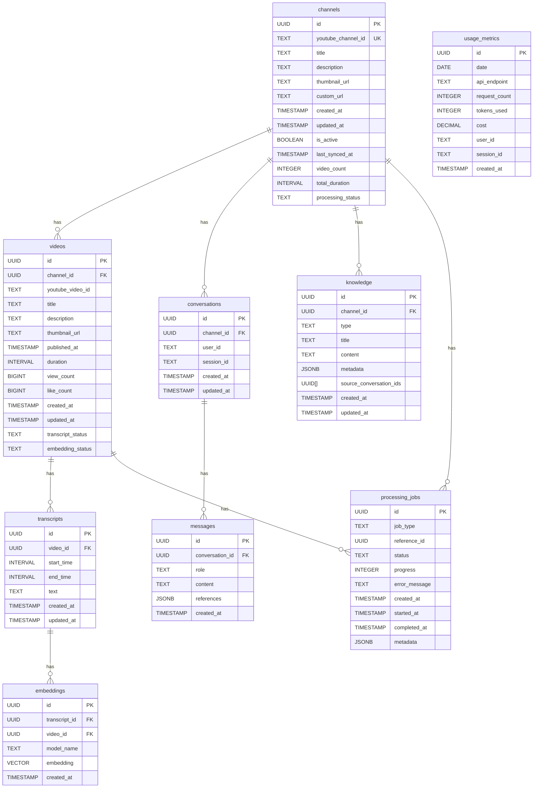

# YouTube Channel Chat App - Data Models

This document outlines the data models for the YouTube Channel Chat App, including tables, relationships, and field definitions.

## Database Schema

### 1. Channels Table

Stores information about YouTube channels available for chatting.

```sql
CREATE TABLE channels (
  id UUID PRIMARY KEY DEFAULT gen_random_uuid(),
  youtube_channel_id TEXT NOT NULL UNIQUE,
  title TEXT NOT NULL,
  description TEXT,
  thumbnail_url TEXT,
  custom_url TEXT,
  created_at TIMESTAMP WITH TIME ZONE DEFAULT NOW(),
  updated_at TIMESTAMP WITH TIME ZONE DEFAULT NOW(),
  is_active BOOLEAN DEFAULT true,
  last_synced_at TIMESTAMP WITH TIME ZONE,
  video_count INTEGER DEFAULT 0,
  total_duration INTERVAL DEFAULT '0'::INTERVAL,
  processing_status TEXT DEFAULT 'pending' -- pending, processing, completed, error
);

-- Indexes
CREATE INDEX idx_channels_youtube_id ON channels(youtube_channel_id);
CREATE INDEX idx_channels_status ON channels(is_active);
```

### 2. Videos Table

Stores metadata for videos from each channel.

```sql
CREATE TABLE videos (
  id UUID PRIMARY KEY DEFAULT gen_random_uuid(),
  channel_id UUID REFERENCES channels(id) ON DELETE CASCADE,
  youtube_video_id TEXT NOT NULL,
  title TEXT NOT NULL,
  description TEXT,
  thumbnail_url TEXT,
  published_at TIMESTAMP WITH TIME ZONE,
  duration INTERVAL,
  view_count BIGINT DEFAULT 0,
  like_count BIGINT DEFAULT 0,
  created_at TIMESTAMP WITH TIME ZONE DEFAULT NOW(),
  updated_at TIMESTAMP WITH TIME ZONE DEFAULT NOW(),
  transcript_status TEXT DEFAULT 'pending', -- pending, available, not_available, error
  embedding_status TEXT DEFAULT 'pending', -- pending, processing, completed, error
  UNIQUE(channel_id, youtube_video_id)
);

-- Indexes
CREATE INDEX idx_videos_channel_id ON videos(channel_id);
CREATE INDEX idx_videos_youtube_id ON videos(youtube_video_id);
CREATE INDEX idx_videos_published_at ON videos(published_at);
CREATE INDEX idx_videos_transcript_status ON videos(transcript_status);
CREATE INDEX idx_videos_embedding_status ON videos(embedding_status);
```

### 3. Transcripts Table

Stores video transcripts with timestamp information.

```sql
CREATE TABLE transcripts (
  id UUID PRIMARY KEY DEFAULT gen_random_uuid(),
  video_id UUID REFERENCES videos(id) ON DELETE CASCADE,
  start_time INTERVAL NOT NULL,
  end_time INTERVAL NOT NULL,
  text TEXT NOT NULL,
  created_at TIMESTAMP WITH TIME ZONE DEFAULT NOW(),
  updated_at TIMESTAMP WITH TIME ZONE DEFAULT NOW()
);

-- Indexes
CREATE INDEX idx_transcripts_video_id ON transcripts(video_id);
CREATE INDEX idx_transcripts_time_range ON transcripts(video_id, start_time, end_time);
```

### 4. Embeddings Table

Stores vector embeddings for transcript segments.

```sql
CREATE TABLE embeddings (
  id UUID PRIMARY KEY DEFAULT gen_random_uuid(),
  transcript_id UUID REFERENCES transcripts(id) ON DELETE CASCADE,
  video_id UUID REFERENCES videos(id) ON DELETE CASCADE,
  model_name TEXT NOT NULL,
  embedding VECTOR(1536) NOT NULL, -- Dimensions depend on the embedding model
  created_at TIMESTAMP WITH TIME ZONE DEFAULT NOW()
);

-- Indexes
CREATE INDEX idx_embeddings_transcript_id ON embeddings(transcript_id);
CREATE INDEX idx_embeddings_video_id ON embeddings(video_id);
-- Vector index for similarity search
CREATE INDEX idx_embeddings_vector ON embeddings USING hnsw (embedding vector_cosine_ops);
```

### 5. Conversations Table

Stores user chat conversations with channels.

```sql
CREATE TABLE conversations (
  id UUID PRIMARY KEY DEFAULT gen_random_uuid(),
  channel_id UUID REFERENCES channels(id) ON DELETE CASCADE,
  user_id TEXT, -- Optional: For authenticated users
  session_id TEXT NOT NULL, -- For anonymous users
  created_at TIMESTAMP WITH TIME ZONE DEFAULT NOW(),
  updated_at TIMESTAMP WITH TIME ZONE DEFAULT NOW()
);

-- Indexes
CREATE INDEX idx_conversations_channel_id ON conversations(channel_id);
CREATE INDEX idx_conversations_user_id ON conversations(user_id);
CREATE INDEX idx_conversations_session_id ON conversations(session_id);
CREATE INDEX idx_conversations_created_at ON conversations(created_at);
```

### 6. Messages Table

Stores individual messages in conversations.

```sql
CREATE TABLE messages (
  id UUID PRIMARY KEY DEFAULT gen_random_uuid(),
  conversation_id UUID REFERENCES conversations(id) ON DELETE CASCADE,
  role TEXT NOT NULL, -- 'user' or 'assistant'
  content TEXT NOT NULL,
  references JSONB, -- Stores references to video segments
  created_at TIMESTAMP WITH TIME ZONE DEFAULT NOW()
);

-- Indexes
CREATE INDEX idx_messages_conversation_id ON messages(conversation_id);
CREATE INDEX idx_messages_role ON messages(role);
CREATE INDEX idx_messages_created_at ON messages(created_at);
```

### 7. Knowledge Table

Stores processed knowledge artifacts from conversations.

```sql
CREATE TABLE knowledge (
  id UUID PRIMARY KEY DEFAULT gen_random_uuid(),
  channel_id UUID REFERENCES channels(id) ON DELETE CASCADE,
  type TEXT NOT NULL, -- 'summary', 'glossary', 'qa_pair'
  title TEXT NOT NULL,
  content TEXT NOT NULL,
  metadata JSONB, -- Additional data specific to each type
  source_conversation_ids UUID[], -- IDs of conversations used to generate this knowledge
  created_at TIMESTAMP WITH TIME ZONE DEFAULT NOW(),
  updated_at TIMESTAMP WITH TIME ZONE DEFAULT NOW()
);

-- Indexes
CREATE INDEX idx_knowledge_channel_id ON knowledge(channel_id);
CREATE INDEX idx_knowledge_type ON knowledge(type);
CREATE INDEX idx_knowledge_created_at ON knowledge(created_at);
```

### 8. Processing Jobs Table

Tracks background processing jobs.

```sql
CREATE TABLE processing_jobs (
  id UUID PRIMARY KEY DEFAULT gen_random_uuid(),
  job_type TEXT NOT NULL, -- 'channel_sync', 'transcript_extraction', 'embedding_generation', 'knowledge_extraction'
  reference_id UUID, -- ID of the related entity (channel_id, video_id, etc.)
  status TEXT NOT NULL, -- 'pending', 'processing', 'completed', 'failed'
  progress INTEGER DEFAULT 0, -- Percentage complete (0-100)
  error_message TEXT,
  created_at TIMESTAMP WITH TIME ZONE DEFAULT NOW(),
  started_at TIMESTAMP WITH TIME ZONE,
  completed_at TIMESTAMP WITH TIME ZONE,
  metadata JSONB -- Additional job-specific data
);

-- Indexes
CREATE INDEX idx_processing_jobs_type ON processing_jobs(job_type);
CREATE INDEX idx_processing_jobs_status ON processing_jobs(status);
CREATE INDEX idx_processing_jobs_reference_id ON processing_jobs(reference_id);
CREATE INDEX idx_processing_jobs_created_at ON processing_jobs(created_at);
```

### 9. Usage Metrics Table

Tracks API usage and costs.

```sql
CREATE TABLE usage_metrics (
  id UUID PRIMARY KEY DEFAULT gen_random_uuid(),
  date DATE NOT NULL,
  api_endpoint TEXT NOT NULL,
  request_count INTEGER DEFAULT 0,
  tokens_used INTEGER DEFAULT 0,
  cost DECIMAL(10, 6) DEFAULT 0,
  user_id TEXT, -- Optional: For authenticated users
  session_id TEXT, -- For anonymous users
  created_at TIMESTAMP WITH TIME ZONE DEFAULT NOW()
);

-- Indexes
CREATE INDEX idx_usage_metrics_date ON usage_metrics(date);
CREATE INDEX idx_usage_metrics_endpoint ON usage_metrics(api_endpoint);
CREATE INDEX idx_usage_metrics_user_id ON usage_metrics(user_id);
CREATE UNIQUE INDEX idx_usage_metrics_unique_date_endpoint_user ON usage_metrics(date, api_endpoint, COALESCE(user_id, ''), COALESCE(session_id, ''));
```

## Relationships



## JSONB Schemas

### 1. Message References

```json
{
  "video_id": "uuid",
  "youtube_video_id": "string",
  "video_title": "string",
  "segments": [
    {
      "transcript_id": "uuid",
      "start_time": "interval",
      "end_time": "interval",
      "text": "string",
      "relevance_score": 0.95
    }
  ],
  "thumbnail_url": "string"
}
```

### 2. Knowledge Metadata

For summaries:
```json
{
  "topic": "string",
  "video_count": 5,
  "related_videos": ["uuid1", "uuid2"],
  "confidence_score": 0.85
}
```

For glossaries:
```json
{
  "terms": [
    {
      "term": "string",
      "definition": "string",
      "context": "string",
      "video_references": ["uuid1", "uuid2"]
    }
  ]
}
```

For Q&A pairs:
```json
{
  "question": "string",
  "answer": "string",
  "related_questions": ["string1", "string2"],
  "video_references": ["uuid1", "uuid2"],
  "confidence_score": 0.9
}
```

### 3. Processing Job Metadata

For channel sync:
```json
{
  "total_videos": 100,
  "processed_videos": 45,
  "new_videos": 5,
  "error_videos": 2
}
```

For embedding generation:
```json
{
  "total_segments": 500,
  "processed_segments": 250,
  "model_name": "text-embedding-ada-002",
  "batch_size": 100
}