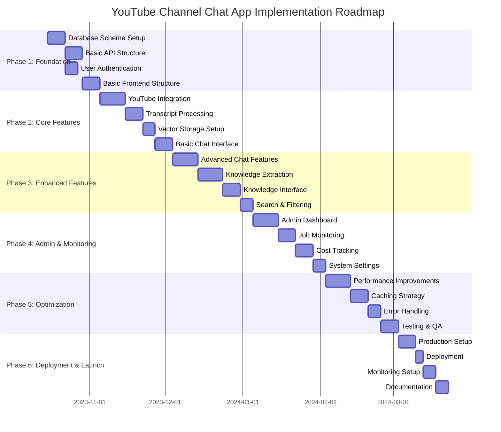
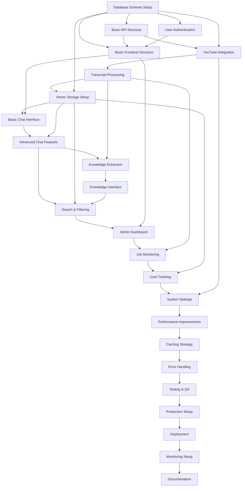

# YouTube Channel Chat App - Implementation Roadmap

This document outlines a detailed implementation roadmap for the YouTube Channel Chat App, including phases, tasks, dependencies, and estimated timelines.

## Overview

The implementation is divided into six major phases, each focusing on specific components of the system. The roadmap is designed to deliver a functional MVP quickly while allowing for incremental improvements and feature additions.

## Implementation Phases

## Phase 1: Foundation (Weeks 1-3)

### 1.1. Database Schema Setup
**Duration**: 1 week  
**Dependencies**: None  
**Tasks**:
- Set up Supabase project
- Create database tables based on data models
- Implement relationships and constraints
- Set up pgvector extension for embeddings
- Create initial seed data for testing

**Deliverables**:
- Fully configured Supabase database
- Database migration scripts
- Seed data for initial testing

### 1.2. Basic API Structure
**Duration**: 1 week  
**Dependencies**: Database Schema Setup  
**Tasks**:
- Set up Next.js API routes structure
- Implement basic error handling middleware
- Create API route templates for all endpoints
- Implement request validation
- Set up CORS and security headers

**Deliverables**:
- API route structure
- Error handling middleware
- Request validation utilities
- Security configuration

### 1.3. User Authentication
**Duration**: 5 days  
**Dependencies**: Database Schema Setup  
**Tasks**:
- Implement user authentication with Supabase Auth
- Create authentication middleware
- Set up protected routes
- Implement user session management
- Create user profile management

**Deliverables**:
- User authentication system
- Protected route middleware
- User profile management

### 1.4. Basic Frontend Structure
**Duration**: 1 week  
**Dependencies**: Basic API Structure, User Authentication  
**Tasks**:
- Set up Next.js app structure
- Implement routing system
- Create basic layout components
- Set up state management
- Implement authentication UI

**Deliverables**:
- Frontend application structure
- Routing system
- Basic UI components
- Authentication UI

## Phase 2: Core Features (Weeks 4-7)

### 2.1. YouTube Integration
**Duration**: 1.5 weeks  
**Dependencies**: Basic API Structure, Database Schema Setup  
**Tasks**:
- Implement YouTube Data API integration
- Create channel data retrieval functions
- Implement video metadata extraction
- Set up API quota management
- Create error handling for YouTube API

**Deliverables**:
- YouTube Data API service
- Channel and video data retrieval
- API quota management system

### 2.2. Transcript Processing
**Duration**: 1 week  
**Dependencies**: YouTube Integration  
**Tasks**:
- Implement transcript extraction (YouTube API + fallbacks)
- Create transcript cleaning and processing
- Implement transcript segmentation
- Set up transcript storage
- Create transcript validation

**Deliverables**:
- Transcript extraction service
- Transcript processing pipeline
- Transcript storage and validation

### 2.3. Vector Storage Setup
**Duration**: 5 days  
**Dependencies**: Transcript Processing, Database Schema Setup  
**Tasks**:
- Configure pgvector in Supabase
- Implement embedding generation service
- Create vector storage functions
- Set up similarity search
- Implement vector indexing

**Deliverables**:
- Configured pgvector extension
- Embedding generation service
- Vector storage and search functions

### 2.4. Basic Chat Interface
**Duration**: 1 week  
**Dependencies**: Vector Storage Setup, Basic Frontend Structure  
**Tasks**:
- Implement chat UI components
- Create message handling
- Implement conversation management
- Set up real-time message updates
- Create basic chat API integration

**Deliverables**:
- Chat interface components
- Message handling system
- Conversation management
- Real-time chat functionality

## Phase 3: Enhanced Features (Weeks 8-11)

### 3.1. Advanced Chat Features
**Duration**: 1.5 weeks  
**Dependencies**: Basic Chat Interface, Vector Storage Setup  
**Tasks**:
- Implement video references in chat responses
- Create deep linking to YouTube videos
- Add message history and persistence
- Implement conversation search
- Add typing indicators and status

**Deliverables**:
- Enhanced chat interface
- Video reference system
- Deep linking functionality
- Conversation search

### 3.2. Knowledge Extraction
**Duration**: 1.5 weeks  
**Dependencies**: Advanced Chat Features, Transcript Processing  
**Tasks**:
- Implement conversation analysis
- Create topic summary generation
- Implement glossary extraction
- Set up Q&A pair identification
- Create knowledge validation

**Deliverables**:
- Conversation analysis system
- Knowledge extraction pipeline
- Topic summary generation
- Glossary and Q&A extraction

### 3.3. Knowledge Interface
**Duration**: 1 week  
**Dependencies**: Knowledge Extraction  
**Tasks**:
- Create knowledge page layout
- Implement topic summary display
- Create glossary browsing interface
- Set up Q&A pair browsing
- Add knowledge search functionality

**Deliverables**:
- Knowledge page components
- Topic summary display
- Glossary browsing interface
- Q&A pair browsing

### 3.4. Search & Filtering
**Duration**: 5 days  
**Dependencies**: Knowledge Interface, Vector Storage Setup  
**Tasks**:
- Implement advanced search functionality
- Create filtering options for knowledge
- Set up search relevance ranking
- Add search analytics
- Implement search suggestions

**Deliverables**:
- Advanced search system
- Filtering options
- Search relevance ranking
- Search analytics

## Phase 4: Admin & Monitoring (Weeks 12-15)

### 4.1. Admin Dashboard
**Duration**: 1.5 weeks  
**Dependencies**: Search & Filtering, Basic Frontend Structure  
**Tasks**:
- Create admin dashboard layout
- Implement system status overview
- Add channel management interface
- Set up admin authentication
- Create admin navigation

**Deliverables**:
- Admin dashboard structure
- System status overview
- Channel management interface
- Admin authentication system

### 4.2. Job Monitoring
**Duration**: 1 week  
**Dependencies**: Admin Dashboard, Transcript Processing  
**Tasks**:
- Create job monitoring interface
- Implement job status tracking
- Add job retry functionality
- Set up job history
- Create job filtering and search

**Deliverables**:
- Job monitoring interface
- Job status tracking
- Job management functionality

### 4.3. Cost Tracking
**Duration**: 1 week  
**Dependencies**: Job Monitoring, Vector Storage Setup  
**Tasks**:
- Implement cost calculation system
- Create cost tracking interface
- Add cost breakdown by service
- Set up cost forecasting
- Create cost alerting

**Deliverables**:
- Cost calculation system
- Cost tracking interface
- Cost breakdown and forecasting

### 4.4. System Settings
**Duration**: 5 days  
**Dependencies**: Cost Tracking, YouTube Integration  
**Tasks**:
- Create system settings interface
- Implement API key management
- Add model configuration
- Set up usage limits
- Create system configuration

**Deliverables**:
- System settings interface
- API key management
- Model and usage configuration

## Phase 5: Optimization (Weeks 16-18)

### 5.1. Performance Improvements
**Duration**: 1.5 weeks  
**Dependencies**: All previous phases  
**Tasks**:
- Optimize database queries
- Implement API response caching
- Optimize frontend rendering
- Add lazy loading for components
- Implement code splitting

**Deliverables**:
- Optimized database queries
- API caching system
- Optimized frontend performance

### 5.2. Caching Strategy
**Duration**: 1 week  
**Dependencies**: Performance Improvements  
**Tasks**:
- Implement Redis caching for API responses
- Create CDN caching for static assets
- Set up browser caching strategy
- Implement cache invalidation
- Add cache monitoring

**Deliverables**:
- Redis caching system
- CDN configuration
- Cache monitoring and management

### 5.3. Error Handling
**Duration**: 5 days  
**Dependencies**: Caching Strategy  
**Tasks**:
- Implement comprehensive error handling
- Create error logging system
- Set up error alerting
- Add user-friendly error messages
- Implement error recovery

**Deliverables**:
- Error handling system
- Error logging and alerting
- User-friendly error messages

### 5.4. Testing & QA
**Duration**: 1 week  
**Dependencies**: Error Handling  
**Tasks**:
- Implement unit tests
- Create integration tests
- Set up end-to-end testing
- Perform load testing
- Conduct security testing

**Deliverables**:
- Test suite
- Test automation
- Performance and security reports

## Phase 6: Deployment & Launch (Weeks 19-20)

### 6.1. Production Setup
**Duration**: 1 week  
**Dependencies**: Testing & QA  
**Tasks**:
- Set up production environment
- Configure production database
- Set up production API
- Configure production frontend
- Set up monitoring and logging

**Deliverables**:
- Production environment
- Production configuration
- Monitoring and logging setup

### 6.2. Deployment
**Duration**: 3 days  
**Dependencies**: Production Setup  
**Tasks**:
- Deploy database schema
- Deploy API services
- Deploy frontend application
- Set up CI/CD pipeline
- Perform deployment verification

**Deliverables**:
- Deployed application
- CI/CD pipeline
- Deployment verification

### 6.3. Monitoring Setup
**Duration**: 5 days  
**Dependencies**: Deployment  
**Tasks**:
- Set up application monitoring
- Configure error tracking
- Implement performance monitoring
- Set up usage analytics
- Create alerting system

**Deliverables**:
- Monitoring system
- Error tracking
- Performance and usage analytics

### 6.4. Documentation
**Duration**: 5 days  
**Dependencies**: Monitoring Setup  
**Tasks**:
- Create user documentation
- Write developer documentation
- Create admin documentation
- Document API endpoints
- Create deployment guide

**Deliverables**:
- Complete documentation set
- User guides
- Developer resources

## Task Dependencies Matrix

## Resource Allocation

### Team Composition
- **Project Manager**: 1 person (20% allocation)
- **Backend Developer**: 1 person (100% allocation)
- **Frontend Developer**: 1 person (100% allocation)
- **DevOps Engineer**: 1 person (30% allocation)
- **QA Engineer**: 1 person (50% allocation)

### Estimated Hours per Phase

| Phase | Backend | Frontend | DevOps | QA | PM | Total |
|-------|---------|----------|--------|----|----|-------|
| Phase 1 | 40 | 40 | 20 | 10 | 16 | 126 |
| Phase 2 | 80 | 60 | 15 | 20 | 16 | 191 |
| Phase 3 | 80 | 80 | 15 | 30 | 24 | 229 |
| Phase 4 | 60 | 40 | 20 | 20 | 20 | 160 |
| Phase 5 | 40 | 40 | 30 | 40 | 16 | 166 |
| Phase 6 | 20 | 20 | 40 | 20 | 16 | 116 |
| **Total** | **320** | **280** | **140** | **140** | **108** | **988** |

## Risk Assessment

### High Risk Items
1. **YouTube API Quota Limitations**
   - **Mitigation**: Implement intelligent caching, quota management, and fallback strategies
   - **Contingency**: Explore alternative transcript sources

2. **Embedding Generation Costs**
   - **Mitigation**: Implement cost tracking, usage limits, and model optimization
   - **Contingency**: Explore open-source embedding models

3. **Performance at Scale**
   - **Mitigation**: Implement caching, database optimization, and load testing
   - **Contingency**: Plan for horizontal scaling

### Medium Risk Items
1. **Transcript Availability**
   - **Mitigation**: Implement multiple transcript extraction methods
   - **Contingency**: Graceful degradation when transcripts unavailable

2. **Knowledge Quality**
   - **Mitigation**: Implement validation, user feedback, and manual review
   - **Contingency**: Provide mechanisms for knowledge correction

3. **User Adoption**
   - **Mitigation**: Focus on user experience, provide tutorials, and gather feedback
   - **Contingency**: Plan for marketing and user education

## Success Metrics

### Technical Metrics
- **API Response Time**: < 500ms for 95% of requests
- **Uptime**: > 99.5%
- **Error Rate**: < 1% of requests
- **Page Load Time**: < 2 seconds

### Business Metrics
- **User Engagement**: > 5 minutes average session duration
- **Channel Processing**: 100% of predefined channels processed
- **Knowledge Generation**: > 50 knowledge artifacts per channel
- **User Satisfaction**: > 4/5 average rating

## Milestones

### Milestone 1: Foundation Complete (End of Week 3)
- Database schema set up
- Basic API structure implemented
- User authentication working
- Basic frontend structure in place

### Milestone 2: MVP Ready (End of Week 7)
- YouTube integration working
- Transcript processing functional
- Vector storage set up
- Basic chat interface operational

### Milestone 3: Feature Complete (End of Week 11)
- Advanced chat features implemented
- Knowledge extraction working
- Knowledge interface complete
- Search and filtering functional

### Milestone 4: Admin Ready (End of Week 15)
- Admin dashboard complete
- Job monitoring working
- Cost tracking implemented
- System settings configurable

### Milestone 5: Production Ready (End of Week 18)
- Performance optimizations complete
- Caching strategy implemented
- Error handling robust
- Testing and QA passed

### Milestone 6: Launch (End of Week 20)
- Production deployment complete
- Monitoring set up
- Documentation finalized
- Application launched

## Conclusion

This implementation roadmap provides a structured approach to building the YouTube Channel Chat App, with clear phases, tasks, dependencies, and timelines. The roadmap is designed to deliver value incrementally while ensuring a robust, scalable, and maintainable final product.

Regular progress reviews and risk assessments should be conducted throughout the implementation to ensure the project stays on track and any issues are addressed promptly.