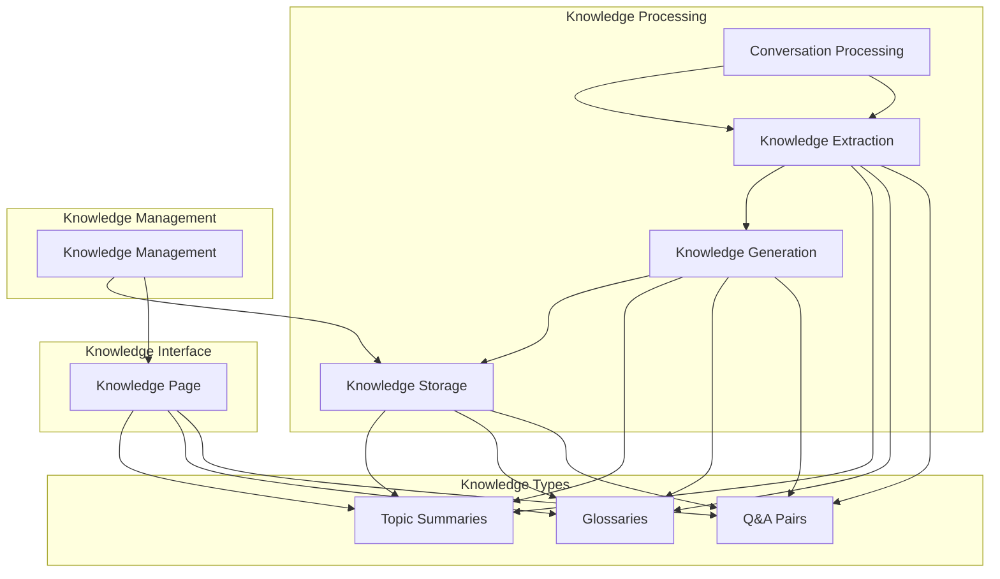

# YouTube Channel Chat App - Knowledge Expansion System

This document outlines the knowledge expansion system for the YouTube Channel Chat App, focusing on generating topic summaries, glossaries, and Q&A pairs from chat conversations.

## Overview

The knowledge expansion system processes chat conversations to extract structured knowledge artifacts that provide additional value beyond individual Q&A interactions. These artifacts include topic summaries, glossaries of key terms, and curated Q&A pairs that can be browsed independently.

## System Architecture



## 1. Knowledge Types

### 1.1. Topic Summaries

Topic summaries provide concise overviews of key themes and subjects discussed in a channel's content.

#### Structure
```typescript
interface TopicSummary {
  id: string;
  channelId: string;
  title: string;
  content: string;
  metadata: {
    topic: string;
    videoCount: number;
    relatedVideos: string[];
    confidenceScore: number;
    keyPoints: string[];
    relatedTopics: string[];
  };
  sourceConversationIds: string[];
  createdAt: string;
  updatedAt: string;
}
```

#### Example
```json
{
  "id": "uuid",
  "channelId": "uuid",
  "title": "Machine Learning Fundamentals",
  "content": "This channel covers the fundamentals of machine learning including supervised learning, unsupervised learning, and deep learning approaches. The content explains key algorithms, practical applications, and implementation considerations for beginners and intermediate learners.",
  "metadata": {
    "topic": "Machine Learning",
    "videoCount": 15,
    "relatedVideos": ["uuid1", "uuid2"],
    "confidenceScore": 0.85,
    "keyPoints": [
      "Supervised vs unsupervised learning",
      "Neural network architectures",
      "Practical implementation tips"
    ],
    "relatedTopics": ["Deep Learning", "Data Science", "AI Ethics"]
  },
  "sourceConversationIds": ["uuid1", "uuid2"],
  "createdAt": "2023-10-15T10:30:00Z",
  "updatedAt": "2023-10-15T11:30:00Z"
}
```

### 1.2. Glossaries

Glossaries define key terms and concepts mentioned in the channel's content with context and examples.

#### Structure
```typescript
interface Glossary {
  id: string;
  channelId: string;
  title: string;
  content: string;
  metadata: {
    terms: GlossaryTerm[];
    category: string;
    difficulty: 'beginner' | 'intermediate' | 'advanced';
  };
  sourceConversationIds: string[];
  createdAt: string;
  updatedAt: string;
}

interface GlossaryTerm {
  term: string;
  definition: string;
  context: string;
  examples: string[];
  relatedTerms: string[];
  videoReferences: string[];
  difficulty: 'beginner' | 'intermediate' | 'advanced';
}
```

#### Example
```json
{
  "id": "uuid",
  "channelId": "uuid",
  "title": "AI Terminology",
  "content": "Key terms and definitions related to artificial intelligence and machine learning",
  "metadata": {
    "terms": [
      {
        "term": "Neural Network",
        "definition": "A computational model inspired by the human brain, consisting of interconnected nodes (neurons) that process information through weighted connections.",
        "context": "Neural networks are fundamental to deep learning and can learn complex patterns from data.",
        "examples": [
          "Image recognition using convolutional neural networks",
          "Natural language processing with transformer models"
        ],
        "relatedTerms": ["Deep Learning", "Backpropagation", "Perceptron"],
        "videoReferences": ["uuid1", "uuid2"],
        "difficulty": "intermediate"
      }
    ],
    "category": "Artificial Intelligence",
    "difficulty": "beginner"
  },
  "sourceConversationIds": ["uuid1", "uuid2"],
  "createdAt": "2023-10-15T09:30:00Z",
  "updatedAt": "2023-10-15T10:30:00Z"
}
```

### 1.3. Q&A Pairs

Q&A pairs capture common questions and detailed answers from conversations, organized for easy browsing.

#### Structure
```typescript
interface QAPair {
  id: string;
  channelId: string;
  title: string;
  content: string;
  metadata: {
    question: string;
    answer: string;
    relatedQuestions: string[];
    videoReferences: string[];
    confidenceScore: number;
    tags: string[];
    difficulty: 'beginner' | 'intermediate' | 'advanced';
  };
  sourceConversationIds: string[];
  createdAt: string;
  updatedAt: string;
}
```

#### Example
```json
{
  "id": "uuid",
  "channelId": "uuid",
  "title": "What is the difference between AI and Machine Learning?",
  "content": "Artificial Intelligence is the broader concept of machines being able to carry out tasks in a smart way, while Machine Learning is a subset of AI that focuses on the idea that machines can learn from data.",
  "metadata": {
    "question": "What is the difference between AI and Machine Learning?",
    "answer": "Artificial Intelligence is the broader concept of machines being able to carry out tasks in a smart way, while Machine Learning is a subset of AI that focuses on the idea that machines can learn from data.",
    "relatedQuestions": [
      "What is deep learning?",
      "How do neural networks work?"
    ],
    "videoReferences": ["uuid1", "uuid2"],
    "confidenceScore": 0.9,
    "tags": ["AI", "Machine Learning", "Basics"],
    "difficulty": "beginner"
  },
  "sourceConversationIds": ["uuid1", "uuid2"],
  "createdAt": "2023-10-15T10:30:00Z",
  "updatedAt": "2023-10-15T11:30:00Z"
}
```

## 2. Knowledge Extraction Process

### 2.1. Conversation Analysis

#### Conversation Selection
- Identify conversations with rich, informative content
- Filter out short or low-value interactions
- Prioritize conversations with multiple exchanges
- Consider user feedback on conversation quality

#### Content Analysis
- Extract key themes and topics
- Identify recurring questions and answers
- Detect technical terms and definitions
- Recognize patterns in user inquiries

```typescript
interface ConversationAnalysis {
  topics: ExtractedTopic[];
  questions: ExtractedQuestion[];
  terms: ExtractedTerm[];
  qualityScore: number;
  knowledgePotential: number;
}

interface ExtractedTopic {
  name: string;
  relevance: number;
  keywords: string[];
  videoReferences: string[];
}

interface ExtractedQuestion {
  text: string;
  answer: string;
  frequency: number;
  context: string;
}

interface ExtractedTerm {
  term: string;
  definition: string;
  context: string;
  frequency: number;
}
```

### 2.2. Knowledge Generation

#### Topic Summary Generation
- Identify main themes across conversations
- Extract key points and concepts
- Generate concise summaries
- Organize by topic hierarchy

```typescript
async function generateTopicSummary(
  channelId: string,
  conversations: Conversation[],
  topic: string
): Promise<TopicSummary> {
  // Extract relevant messages from conversations
  const relevantMessages = extractRelevantMessages(conversations, topic);
  
  // Generate summary using LLM
  const summaryPrompt = `
    Based on the following conversations about ${topic}, generate a comprehensive summary:
    
    ${relevantMessages.map(m => `${m.role}: ${m.content}`).join('\n')}
    
    The summary should:
    1. Provide an overview of the topic
    2. Cover key points and concepts
    3. Mention practical applications
    4. Be concise but informative
  `;
  
  const summaryContent = await llmService.generateText(summaryPrompt);
  
  // Extract key points
  const keyPointsPrompt = `
    Extract 3-5 key points from this summary:
    
    ${summaryContent}
    
    Return them as a JSON array of strings.
  `;
  
  const keyPointsResponse = await llmService.generateText(keyPointsPrompt);
  const keyPoints = JSON.parse(keyPointsResponse);
  
  // Identify related topics
  const relatedTopicsPrompt = `
    Based on this summary about ${topic}, suggest 2-3 related topics:
    
    ${summaryContent}
    
    Return them as a JSON array of strings.
  `;
  
  const relatedTopicsResponse = await llmService.generateText(relatedTopicsPrompt);
  const relatedTopics = JSON.parse(relatedTopicsResponse);
  
  return {
    id: generateId(),
    channelId,
    title: `${topic} Summary`,
    content: summaryContent,
    metadata: {
      topic,
      videoCount: extractVideoCount(relevantMessages),
      relatedVideos: extractVideoReferences(relevantMessages),
      confidenceScore: calculateConfidence(relevantMessages),
      keyPoints,
      relatedTopics
    },
    sourceConversationIds: conversations.map(c => c.id),
    createdAt: new Date().toISOString(),
    updatedAt: new Date().toISOString()
  };
}
```

#### Glossary Generation
- Identify technical terms and jargon
- Extract definitions from context
- Organize terms by category
- Provide examples and usage

```typescript
async function generateGlossary(
  channelId: string,
  conversations: Conversation[],
  category: string
): Promise<Glossary> {
  // Extract terms from conversations
  const extractedTerms = await extractTerms(conversations, category);
  
  // Process each term
  const glossaryTerms = await Promise.all(
    extractedTerms.map(async (term) => {
      // Generate detailed definition
      const definitionPrompt = `
        Based on the following context, provide a comprehensive definition for "${term.term}":
        
        Context: ${term.context}
        
        The definition should:
        1. Be clear and concise
        2. Include technical accuracy
        3. Provide context for understanding
      `;
      
      const definition = await llmService.generateText(definitionPrompt);
      
      // Generate examples
      const examplesPrompt = `
        Provide 2-3 examples of how "${term.term}" is used in practice:
        
        Definition: ${definition}
        
        Return them as a JSON array of strings.
      `;
      
      const examplesResponse = await llmService.generateText(examplesPrompt);
      const examples = JSON.parse(examplesResponse);
      
      return {
        term: term.term,
        definition,
        context: term.context,
        examples,
        relatedTerms: term.relatedTerms,
        videoReferences: term.videoReferences,
        difficulty: term.difficulty
      };
    })
  );
  
  return {
    id: generateId(),
    channelId,
    title: `${category} Glossary`,
    content: `Key terms and definitions related to ${category}`,
    metadata: {
      terms: glossaryTerms,
      category,
      difficulty: calculateOverallDifficulty(glossaryTerms)
    },
    sourceConversationIds: conversations.map(c => c.id),
    createdAt: new Date().toISOString(),
    updatedAt: new Date().toISOString()
  };
}
```

#### Q&A Pair Generation
- Extract high-quality question-answer pairs
- Refine and enhance answers
- Organize by topic and difficulty
- Add related questions for exploration

```typescript
async function generateQAPairs(
  channelId: string,
  conversations: Conversation[]
): Promise<QAPair[]> {
  // Extract potential Q&A pairs
  const potentialPairs = extractPotentialQAPairs(conversations);
  
  // Process each pair
  const qaPairs = await Promise.all(
    potentialPairs.map(async (pair) => {
      // Enhance the answer
      const enhancedAnswerPrompt = `
        Enhance this answer to make it more comprehensive and informative:
        
        Question: ${pair.question}
        Current Answer: ${pair.answer}
        
        The enhanced answer should:
        1. Provide more detail and context
        2. Include examples where appropriate
        3. Address potential follow-up questions
        4. Be well-structured and clear
      `;
      
      const enhancedAnswer = await llmService.generateText(enhancedAnswerPrompt);
      
      // Generate related questions
      const relatedQuestionsPrompt = `
        Based on this Q&A pair, suggest 2-3 related questions:
        
        Question: ${pair.question}
        Answer: ${enhancedAnswer}
        
        Return them as a JSON array of strings.
      `;
      
      const relatedQuestionsResponse = await llmService.generateText(relatedQuestionsPrompt);
      const relatedQuestions = JSON.parse(relatedQuestionsResponse);
      
      // Generate tags
      const tagsPrompt = `
        Suggest 3-5 tags for this Q&A pair:
        
        Question: ${pair.question}
        Answer: ${enhancedAnswer}
        
        Return them as a JSON array of strings.
      `;
      
      const tagsResponse = await llmService.generateText(tagsPrompt);
      const tags = JSON.parse(tagsResponse);
      
      return {
        id: generateId(),
        channelId,
        title: pair.question,
        content: enhancedAnswer,
        metadata: {
          question: pair.question,
          answer: enhancedAnswer,
          relatedQuestions,
          videoReferences: pair.videoReferences,
          confidenceScore: pair.confidenceScore,
          tags,
          difficulty: pair.difficulty
        },
        sourceConversationIds: pair.sourceConversationIds,
        createdAt: new Date().toISOString(),
        updatedAt: new Date().toISOString()
      };
    })
  );
  
  return qaPairs;
}
```

## 3. Knowledge Management

### 3.1. Knowledge Storage

#### Database Schema
- Utilize the existing `knowledge` table from the data model
- Store different knowledge types with appropriate metadata
- Maintain relationships to source conversations and videos

#### Indexing and Search
- Create indexes for efficient knowledge retrieval
- Implement full-text search for knowledge content
- Support filtering by type, topic, and metadata

### 3.2. Knowledge Updates

#### Incremental Updates
- Process new conversations as they occur
- Update existing knowledge with new information
- Identify and merge related knowledge artifacts

#### Knowledge Refresh
- Periodically regenerate knowledge from all conversations
- Update outdated information
- Improve knowledge quality over time

```typescript
async function updateKnowledgeFromConversation(
  conversationId: string,
  channelId: string
): Promise<void> {
  // Get the conversation
  const conversation = await getConversation(conversationId);
  
  // Analyze conversation for knowledge potential
  const analysis = await analyzeConversation(conversation);
  
  if (analysis.knowledgePotential > THRESHOLD) {
    // Generate new knowledge artifacts
    const topics = await extractTopics(conversation);
    const terms = await extractTerms(conversation);
    const questions = await extractQuestions(conversation);
    
    // Update or create topic summaries
    for (const topic of topics) {
      await updateOrCreateTopicSummary(channelId, topic, [conversation]);
    }
    
    // Update or create glossary entries
    for (const term of terms) {
      await updateOrCreateGlossaryEntry(channelId, term, [conversation]);
    }
    
    // Update or create Q&A pairs
    for (const question of questions) {
      await updateOrCreateQAPair(channelId, question, [conversation]);
    }
  }
}
```

### 3.3. Knowledge Quality Assurance

#### Quality Metrics
- Confidence scores based on source quality
- User feedback and ratings
- Accuracy and completeness checks
- Consistency across related knowledge

#### Knowledge Validation
- Implement validation rules for generated knowledge
- Use multiple sources for verification
- Allow manual review and editing

## 4. Knowledge Interface

### 4.1. Knowledge Page Design

#### Page Structure
- Header with channel information
- Tabs or sections for different knowledge types
- Search and filtering capabilities
- Browsing by topic or category

```typescript
// src/app/knowledge/page.tsx
export default function KnowledgePage() {
  const [selectedChannel, setSelectedChannel] = useState<string>();
  const [activeTab, setActiveTab] = useState<'summaries' | 'glossary' | 'qa'>('summaries');
  const [searchQuery, setSearchQuery] = useState('');
  const [selectedTopic, setSelectedTopic] = useState<string>();
  
  return (
    <div className="min-h-screen bg-background">
      <Header />
      
      <main className="container mx-auto px-4 py-8">
        <div className="mb-8">
          <h1 className="text-3xl font-bold mb-2">Knowledge Base</h1>
          <p className="text-muted-foreground">
            Explore topic summaries, glossaries, and Q&A pairs from channel conversations
          </p>
        </div>
        
        <div className="grid grid-cols-1 lg:grid-cols-4 gap-6">
          {/* Sidebar */}
          <div className="lg:col-span-1">
            <ChannelSelector
              selectedChannelId={selectedChannel}
              onChannelSelect={setSelectedChannel}
            />
            
            {selectedChannel && (
              <TopicFilter
                channelId={selectedChannel}
                selectedTopic={selectedTopic}
                onTopicSelect={setSelectedTopic}
              />
            )}
          </div>
          
          {/* Main Content */}
          <div className="lg:col-span-3">
            <div className="mb-6">
              <div className="flex flex-col sm:flex-row gap-4 mb-4">
                <Tabs value={activeTab} onValueChange={(value) => setActiveTab(value as any)}>
                  <TabsList>
                    <TabsTrigger value="summaries">Summaries</TabsTrigger>
                    <TabsTrigger value="glossary">Glossary</TabsTrigger>
                    <TabsTrigger value="qa">Q&A</TabsTrigger>
                  </TabsList>
                </Tabs>
                
                <div className="flex-1">
                  <SearchInput
                    value={searchQuery}
                    onChange={setSearchQuery}
                    placeholder="Search knowledge..."
                  />
                </div>
              </div>
            </div>
            
            <div className="tab-content">
              {activeTab === 'summaries' && (
                <TopicSummaries
                  channelId={selectedChannel}
                  topic={selectedTopic}
                  searchQuery={searchQuery}
                />
              )}
              
              {activeTab === 'glossary' && (
                <Glossary
                  channelId={selectedChannel}
                  topic={selectedTopic}
                  searchQuery={searchQuery}
                />
              )}
              
              {activeTab === 'qa' && (
                <QAPairs
                  channelId={selectedChannel}
                  topic={selectedTopic}
                  searchQuery={searchQuery}
                />
              )}
            </div>
          </div>
        </div>
      </main>
    </div>
  );
}
```

### 4.2. Topic Summaries Component

```typescript
// src/components/knowledge/TopicSummaries.tsx
interface TopicSummariesProps {
  channelId?: string;
  topic?: string;
  searchQuery?: string;
}

export function TopicSummaries({ channelId, topic, searchQuery }: TopicSummariesProps) {
  const { data: summaries, isLoading } = useKnowledgeSummaries({
    channelId,
    topic,
    searchQuery
  });
  
  if (isLoading) {
    return <KnowledgeLoading />;
  }
  
  if (!summaries || summaries.length === 0) {
    return <KnowledgeEmpty type="summaries" />;
  }
  
  return (
    <div className="space-y-4">
      {summaries.map((summary) => (
        <TopicSummaryCard key={summary.id} summary={summary} />
      ))}
    </div>
  );
}

interface TopicSummaryCardProps {
  summary: TopicSummary;
}

function TopicSummaryCard({ summary }: TopicSummaryCardProps) {
  return (
    <Card>
      <CardHeader>
        <div className="flex items-start justify-between">
          <div>
            <CardTitle className="text-xl">{summary.title}</CardTitle>
            <CardDescription className="mt-1">
              {summary.metadata.topic} • {summary.metadata.videoCount} videos
            </CardDescription>
          </div>
          <Badge variant="secondary">
            {Math.round(summary.metadata.confidenceScore * 100)}% confidence
          </Badge>
        </div>
      </CardHeader>
      <CardContent>
        <p className="mb-4">{summary.content}</p>
        
        {summary.metadata.keyPoints.length > 0 && (
          <div className="mb-4">
            <h4 className="font-medium mb-2">Key Points:</h4>
            <ul className="list-disc pl-5 space-y-1">
              {summary.metadata.keyPoints.map((point, index) => (
                <li key={index} className="text-sm">{point}</li>
              ))}
            </ul>
          </div>
        )}
        
        {summary.metadata.relatedTopics.length > 0 && (
          <div className="flex flex-wrap gap-2">
            {summary.metadata.relatedTopics.map((relatedTopic, index) => (
              <Badge key={index} variant="outline" className="text-xs">
                {relatedTopic}
              </Badge>
            ))}
          </div>
        )}
      </CardContent>
    </Card>
  );
}
```

### 4.3. Glossary Component

```typescript
// src/components/knowledge/Glossary.tsx
interface GlossaryProps {
  channelId?: string;
  topic?: string;
  searchQuery?: string;
}

export function Glossary({ channelId, topic, searchQuery }: GlossaryProps) {
  const { data: glossaries, isLoading } = useKnowledgeGlossaries({
    channelId,
    topic,
    searchQuery
  });
  
  if (isLoading) {
    return <KnowledgeLoading />;
  }
  
  if (!glossaries || glossaries.length === 0) {
    return <KnowledgeEmpty type="glossary" />;
  }
  
  return (
    <div className="space-y-4">
      {glossaries.map((glossary) => (
        <GlossaryCard key={glossary.id} glossary={glossary} />
      ))}
    </div>
  );
}

interface GlossaryCardProps {
  glossary: Glossary;
}

function GlossaryCard({ glossary }: GlossaryCardProps) {
  const [expandedTerms, setExpandedTerms] = useState<Set<string>>(new Set());
  
  const toggleTerm = (term: string) => {
    const newExpanded = new Set(expandedTerms);
    if (newExpanded.has(term)) {
      newExpanded.delete(term);
    } else {
      newExpanded.add(term);
    }
    setExpandedTerms(newExpanded);
  };
  
  return (
    <Card>
      <CardHeader>
        <div className="flex items-start justify-between">
          <div>
            <CardTitle className="text-xl">{glossary.title}</CardTitle>
            <CardDescription className="mt-1">
              {glossary.metadata.category} • {glossary.metadata.difficulty}
            </CardDescription>
          </div>
        </div>
      </CardHeader>
      <CardContent>
        <div className="space-y-3">
          {glossary.metadata.terms.map((term, index) => (
            <div key={index} className="border rounded-lg p-3">
              <div 
                className="flex items-center justify-between cursor-pointer"
                onClick={() => toggleTerm(term.term)}
              >
                <h3 className="font-medium">{term.term}</h3>
                <div className="flex items-center space-x-2">
                  <Badge variant="outline" className="text-xs">
                    {term.difficulty}
                  </Badge>
                  {expandedTerms.has(term.term) ? (
                    <ChevronUp className="h-4 w-4" />
                  ) : (
                    <ChevronDown className="h-4 w-4" />
                  )}
                </div>
              </div>
              
              <p className="text-sm mt-2">{term.definition}</p>
              
              {expandedTerms.has(term.term) && (
                <div className="mt-3 space-y-2">
                  {term.context && (
                    <div>
                      <p className="text-xs font-medium text-muted-foreground">Context:</p>
                      <p className="text-xs">{term.context}</p>
                    </div>
                  )}
                  
                  {term.examples.length > 0 && (
                    <div>
                      <p className="text-xs font-medium text-muted-foreground">Examples:</p>
                      <ul className="list-disc pl-5 mt-1">
                        {term.examples.map((example, i) => (
                          <li key={i} className="text-xs">{example}</li>
                        ))}
                      </ul>
                    </div>
                  )}
                  
                  {term.relatedTerms.length > 0 && (
                    <div className="flex flex-wrap gap-1">
                      {term.relatedTerms.map((relatedTerm, i) => (
                        <Badge key={i} variant="outline" className="text-xs">
                          {relatedTerm}
                        </Badge>
                      ))}
                    </div>
                  )}
                </div>
              )}
            </div>
          ))}
        </div>
      </CardContent>
    </Card>
  );
}
```

### 4.4. Q&A Pairs Component

```typescript
// src/components/knowledge/QAPairs.tsx
interface QAPairsProps {
  channelId?: string;
  topic?: string;
  searchQuery?: string;
}

export function QAPairs({ channelId, topic, searchQuery }: QAPairsProps) {
  const { data: qaPairs, isLoading } = useKnowledgeQAPairs({
    channelId,
    topic,
    searchQuery
  });
  
  if (isLoading) {
    return <KnowledgeLoading />;
  }
  
  if (!qaPairs || qaPairs.length === 0) {
    return <KnowledgeEmpty type="Q&A pairs" />;
  }
  
  return (
    <div className="space-y-4">
      {qaPairs.map((qaPair) => (
        <QAPairCard key={qaPair.id} qaPair={qaPair} />
      ))}
    </div>
  );
}

interface QAPairCardProps {
  qaPair: QAPair;
}

function QAPairCard({ qaPair }: QAPairCardProps) {
  const [showRelated, setShowRelated] = useState(false);
  
  return (
    <Card>
      <CardHeader>
        <div className="flex items-start justify-between">
          <div>
            <CardTitle className="text-lg">{qaPair.metadata.question}</CardTitle>
            <div className="flex items-center space-x-2 mt-1">
              <Badge variant="outline" className="text-xs">
                {qaPair.metadata.difficulty}
              </Badge>
              <Badge variant="secondary" className="text-xs">
                {Math.round(qaPair.metadata.confidenceScore * 100)}% confidence
              </Badge>
            </div>
          </div>
        </div>
      </CardHeader>
      <CardContent>
        <div className="prose prose-sm max-w-none">
          <p>{qaPair.metadata.answer}</p>
        </div>
        
        {qaPair.metadata.tags.length > 0 && (
          <div className="flex flex-wrap gap-1 mt-3">
            {qaPair.metadata.tags.map((tag, index) => (
              <Badge key={index} variant="outline" className="text-xs">
                {tag}
              </Badge>
            ))}
          </div>
        )}
        
        {qaPair.metadata.relatedQuestions.length > 0 && (
          <div className="mt-4">
            <Button
              variant="ghost"
              size="sm"
              onClick={() => setShowRelated(!showRelated)}
              className="text-xs"
            >
              {showRelated ? 'Hide' : 'Show'} Related Questions
              {showRelated ? <ChevronUp className="h-3 w-3 ml-1" /> : <ChevronDown className="h-3 w-3 ml-1" />}
            </Button>
            
            {showRelated && (
              <ul className="mt-2 space-y-1">
                {qaPair.metadata.relatedQuestions.map((question, index) => (
                  <li key={index} className="text-sm text-muted-foreground">
                    • {question}
                  </li>
                ))}
              </ul>
            )}
          </div>
        )}
      </CardContent>
    </Card>
  );
}
```

## 5. Implementation Roadmap

1. **Phase 1**: Basic Knowledge Extraction
   - Implement conversation analysis
   - Create basic knowledge generation functions
   - Set up knowledge storage

2. **Phase 2**: Knowledge Types Implementation
   - Implement topic summary generation
   - Create glossary generation
   - Develop Q&A pair extraction

3. **Phase 3**: Knowledge Management
   - Implement knowledge update mechanisms
   - Add quality assurance features
   - Create knowledge refresh processes

4. **Phase 4**: Knowledge Interface
   - Design and implement knowledge page
   - Create components for each knowledge type
   - Add search and filtering capabilities

5. **Phase 5**: Advanced Features
   - Implement knowledge relationships
   - Add user feedback mechanisms
   - Create knowledge export functionality

6. **Phase 6**: Optimization and Scaling
   - Optimize knowledge generation performance
   - Implement caching strategies
   - Add monitoring and analytics