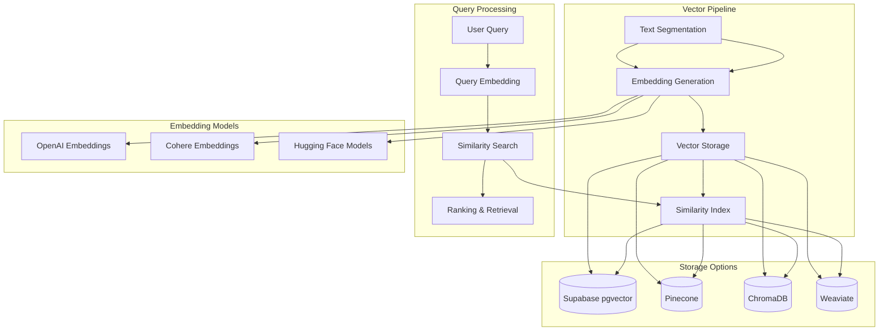

# YouTube Channel Chat App - Vector Storage and Retrieval System

This document outlines the vector storage and retrieval system for the YouTube Channel Chat App, including embedding generation, storage, similarity search, and retrieval strategies.

## Overview

The vector system is responsible for converting video transcripts into numerical representations (embeddings) that enable semantic search and retrieval of relevant content based on user queries. This is a core component of the chat functionality.

## System Architecture



## 1. Text Segmentation

Before generating embeddings, video transcripts need to be segmented into manageable chunks.

### 1.1. Segmentation Strategy

- **Fixed Size Segments**: Split transcripts into fixed-size chunks (e.g., 500 tokens)
- **Semantic Segments**: Use semantic boundaries (sentences, paragraphs) where possible
- **Overlap Strategy**: Include overlap between segments (e.g., 50 tokens) to maintain context

### 1.2. Segment Metadata

Each segment will include:
- Video ID and YouTube video ID
- Start and end timestamps
- Position within the video
- Text content
- Segment sequence number

### 1.3. Implementation

```typescript
interface TranscriptSegment {
  id: string;
  videoId: string;
  youtubeVideoId: string;
  startTime: number; // in seconds
  endTime: number; // in seconds
  text: string;
  sequence: number;
  tokenCount: number;
}
```

## 2. Embedding Generation

### 2.1. Embedding Models

We'll evaluate several embedding model options:

#### Option 1: OpenAI Embeddings
- **Model**: text-embedding-ada-002 or text-embedding-3-small/large
- **Dimensions**: 1536 (ada-002) or 512/1536/3072 (text-embedding-3)
- **Pros**: High quality, easy to integrate
- **Cons**: Cost at scale, rate limits

#### Option 2: Cohere Embeddings
- **Model**: embed-multilingual-v3.0 or embed-english-v3.0
- **Dimensions**: 1024
- **Pros**: Good multilingual support, competitive performance
- **Cons**: Cost at scale

#### Option 3: Open Source Models (Hugging Face)
- **Models**: sentence-transformers/all-MiniLM-L6-v2, sentence-transformers/all-mpnet-base-v2
- **Dimensions**: 384 (MiniLM) or 768 (mpnet)
- **Pros**: Free, self-hosted, no rate limits
- **Cons**: Lower quality, requires infrastructure

### 2.2. Embedding Process

1. **Text Preprocessing**:
   - Clean text (remove special characters, normalize whitespace)
   - Handle multilingual content if present
   - Truncate or pad to optimal length

2. **Batch Processing**:
   - Process segments in batches for efficiency
   - Handle API rate limits and retries
   - Track processing status and errors

3. **Quality Assurance**:
   - Validate embedding dimensions
   - Check for failed generations
   - Implement fallback mechanisms

### 2.3. Implementation

```typescript
interface EmbeddingService {
  generateEmbeddings(texts: string[]): Promise<number[][]>;
  getModelInfo(): {
    name: string;
    dimensions: number;
    maxTokens: number;
  };
}

class OpenAIEmbeddingService implements EmbeddingService {
  async generateEmbeddings(texts: string[]): Promise<number[][]> {
    // Implementation using OpenAI API
  }
  
  getModelInfo() {
    return {
      name: 'text-embedding-ada-002',
      dimensions: 1536,
      maxTokens: 8191
    };
  }
}
```

## 3. Vector Storage Options

### 3.1. Supabase with pgvector

#### Overview
Use Supabase's PostgreSQL database with the pgvector extension for vector storage and similarity search.

#### Pros
- Integrated with existing database
- Single database to manage
- Cost-effective for small to medium datasets
- SQL-based queries

#### Cons
- Limited vector-specific features
- Performance concerns at very large scale
- Requires manual index management

#### Implementation
```sql
-- Enable pgvector extension
CREATE EXTENSION IF NOT EXISTS vector;

-- Create embeddings table (already defined in data models)
CREATE TABLE embeddings (
  id UUID PRIMARY KEY DEFAULT gen_random_uuid(),
  transcript_id UUID REFERENCES transcripts(id) ON DELETE CASCADE,
  video_id UUID REFERENCES videos(id) ON DELETE CASCADE,
  model_name TEXT NOT NULL,
  embedding VECTOR(1536) NOT NULL,
  created_at TIMESTAMP WITH TIME ZONE DEFAULT NOW()
);

-- Create HNSW index for approximate nearest neighbor search
CREATE INDEX idx_embeddings_vector ON embeddings 
USING hnsw (embedding vector_cosine_ops)
WITH (m = 16, ef_construction = 64);
```

### 3.2. Pinecone

#### Overview
Managed vector database service designed for high-performance similarity search.

#### Pros
- Excellent performance at scale
- Managed service (no infrastructure)
- Advanced filtering capabilities
- Good documentation and integrations

#### Cons
- Additional cost
- Another service to manage
- Vendor lock-in

#### Implementation
```typescript
import { Pinecone } from '@pinecone-database/pinecone';

const pinecone = new Pinecone({
  apiKey: process.env.PINECONE_API_KEY,
});

// Create index
await pinecone.createIndex({
  name: 'youtube-transcripts',
  dimension: 1536,
  metric: 'cosine',
  spec: {
    serverless: {
      cloud: 'aws',
      region: 'us-west-2'
    }
  }
});

// Upsert vectors
const index = pinecone.index('youtube-transcripts');
await index.upsert([
  {
    id: 'segment1',
    values: embedding,
    metadata: {
      videoId: 'video1',
      startTime: 30,
      endTime: 60,
      text: 'Segment text...'
    }
  }
]);
```

### 3.3. ChromaDB

#### Overview
Open-source vector database designed for AI applications.

#### Pros
- Open source and self-hostable
- Good for small to medium datasets
- Simple API
- Integrates well with Python ecosystem

#### Cons
- Less mature than commercial options
- Performance concerns at large scale
- Primarily Python-focused

### 3.4. Weaviate

#### Overview
Open-source vector database with GraphQL API.

#### Pros
- Open source and self-hostable
- GraphQL API
- Good performance
- Hybrid search capabilities

#### Cons
- Complex setup
- Steeper learning curve
- Resource-intensive

## 4. Similarity Search and Retrieval

### 4.1. Query Processing

1. **Query Embedding**:
   - Convert user query to embedding using the same model as transcripts
   - Handle query preprocessing (cleaning, normalization)

2. **Search Strategy**:
   - **Approximate Nearest Neighbor (ANN)**: For fast search at scale
   - **Exact Search**: For smaller datasets or when precision is critical
   - **Hybrid Search**: Combine vector search with keyword search

### 4.2. Filtering and Ranking

1. **Metadata Filtering**:
   - Filter by channel, video, or time range
   - Combine vector similarity with metadata filters

2. **Re-ranking**:
   - Apply additional ranking algorithms to initial results
   - Consider temporal relevance (recent videos)
   - Boost based on video popularity or quality

### 4.3. Implementation with pgvector

```typescript
async function searchSimilarTranscripts(
  queryEmbedding: number[],
  channelId?: string,
  limit: number = 10
): Promise<TranscriptSegment[]> {
  const { data, error } = await supabase.rpc('match_transcripts', {
    query_embedding: queryEmbedding,
    match_threshold: 0.7,
    match_count: limit,
    channel_id: channelId
  });
  
  if (error) throw error;
  return data;
}
```

PostgreSQL function for similarity search:
```sql
CREATE OR REPLACE FUNCTION match_transcripts(
  query_embedding VECTOR(1536),
  match_threshold FLOAT,
  match_count INT,
  channel_id UUID DEFAULT NULL
)
RETURNS TABLE(
  id UUID,
  video_id UUID,
  youtube_video_id TEXT,
  video_title TEXT,
  thumbnail_url TEXT,
  start_time INTERVAL,
  end_time INTERVAL,
  text TEXT,
  similarity FLOAT
)
LANGUAGE plpgsql
AS $$
BEGIN
  RETURN QUERY
  SELECT
    e.id,
    v.id AS video_id,
    v.youtube_video_id,
    v.title AS video_title,
    v.thumbnail_url,
    t.start_time,
    t.end_time,
    t.text,
    1 - (e.embedding <=> query_embedding) AS similarity
  FROM embeddings e
  JOIN transcripts t ON e.transcript_id = t.id
  JOIN videos v ON e.video_id = v.id
  WHERE
    (channel_id IS NULL OR v.channel_id = match_transcripts.channel_id) AND
    1 - (e.embedding <=> query_embedding) > match_threshold
  ORDER BY e.embedding <=> query_embedding
  LIMIT match_count;
END;
$$;
```

### 4.4. Implementation with Pinecone

```typescript
async function searchSimilarTranscripts(
  queryEmbedding: number[],
  channelId?: string,
  limit: number = 10
): Promise<TranscriptSegment[]> {
  const index = pinecone.index('youtube-transcripts');
  
  const queryOptions: any = {
    vector: queryEmbedding,
    topK: limit,
    includeMetadata: true
  };
  
  if (channelId) {
    queryOptions.filter = { channelId: { '$eq': channelId } };
  }
  
  const queryResponse = await index.query(queryOptions);
  
  return queryResponse.matches.map(match => ({
    id: match.id,
    videoId: match.metadata.videoId,
    youtubeVideoId: match.metadata.youtubeVideoId,
    startTime: match.metadata.startTime,
    endTime: match.metadata.endTime,
    text: match.metadata.text,
    similarity: match.score
  }));
}
```

## 5. Performance Optimization

### 5.1. Indexing Strategies

- **HNSW (Hierarchical Navigable Small World)**: For approximate nearest neighbor search
- **IVFFlat (Inverted File)**: For faster index build time with good recall
- **Exact Search**: For small datasets or when precision is critical

### 5.2. Caching

- **Query Cache**: Cache frequent queries and results
- **Embedding Cache**: Cache embeddings for common queries
- **Pre-computation**: Pre-compute embeddings for popular content

### 5.3. Batch Processing

- Process embeddings in batches to optimize API usage
- Implement background jobs for large-scale processing
- Use queue systems for managing embedding generation

## 6. Monitoring and Maintenance

### 6.1. Performance Metrics

- **Query Latency**: Time taken for similarity search
- **Index Size**: Storage used by vector indexes
- **Recall/Precision**: Quality of search results
- **API Usage**: Tokens used and costs for embedding generation

### 6.2. Maintenance Tasks

- **Index Optimization**: Rebuild or tune indexes as needed
- **Model Updates**: Update embedding models as new versions become available
- **Data Cleanup**: Remove or archive old or unused embeddings

## 7. Recommendation

For this project, we recommend starting with **Supabase pgvector** for the following reasons:

1. **Integration**: Seamless integration with existing Supabase database
2. **Cost**: No additional service costs for small to medium datasets
3. **Simplicity**: Single database to manage and maintain
4. **Adequate Performance**: Good performance for the expected scale of the project

As the project grows, we can evaluate migrating to a dedicated vector database like Pinecone if performance becomes a concern.

## 8. Implementation Roadmap

1. **Phase 1**: Implement basic embedding generation with OpenAI
2. **Phase 2**: Set up pgvector in Supabase and create embeddings table
3. **Phase 3**: Implement similarity search functions
4. **Phase 4**: Integrate vector search with chat API
5. **Phase 5**: Add performance monitoring and optimization
6. **Phase 6**: Evaluate and implement advanced features (hybrid search, re-ranking)