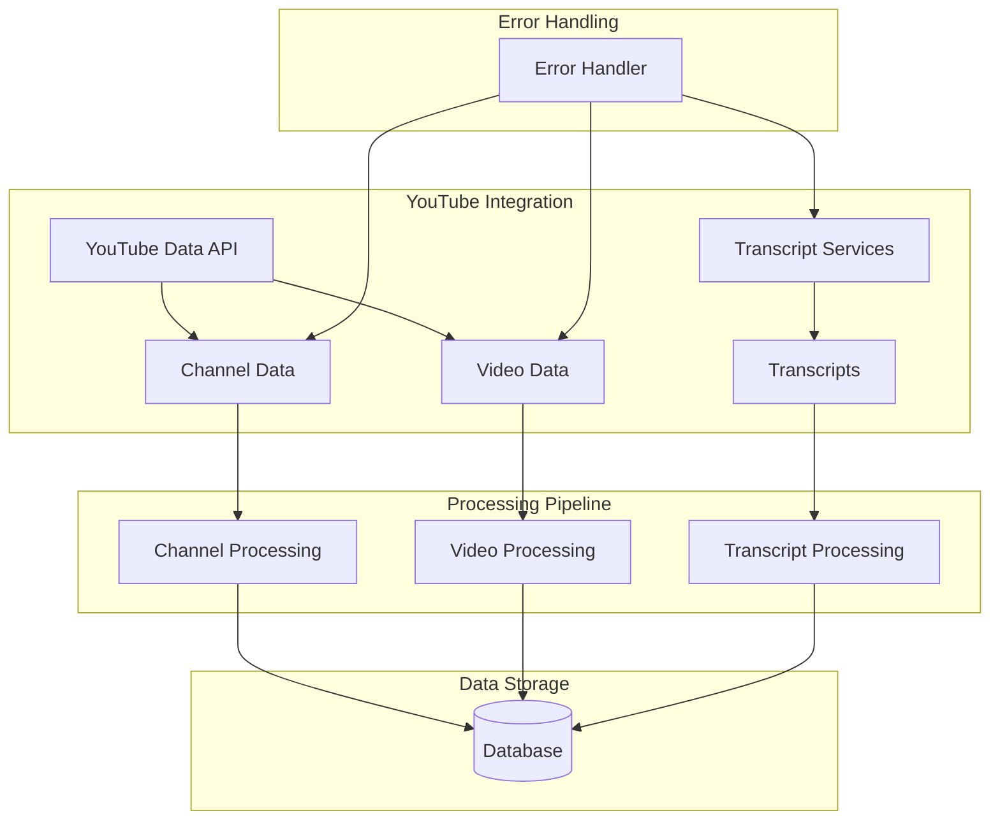

# YouTube Channel Chat App - YouTube Integration for Transcript Extraction

This document outlines the YouTube integration strategy for the YouTube Channel Chat App, focusing on channel data retrieval, video metadata extraction, and transcript extraction.

## Overview

The YouTube integration is responsible for fetching channel information, video metadata, and transcripts from YouTube. This data forms the foundation of the chat system, enabling users to query and interact with YouTube channel content.

## System Architecture



## 1. YouTube Data API Integration

### 1.1. API Setup

#### API Key Configuration
- Register for YouTube Data API v3 in Google Cloud Console
- Create API key with appropriate permissions
- Store API key securely in environment variables

```typescript
// config/youtube.ts
export const YOUTUBE_API_CONFIG = {
  apiKey: process.env.YOUTUBE_API_KEY,
  baseUrl: 'https://www.googleapis.com/youtube/v3',
  maxResults: 50, // Maximum results per page
  quota: {
    daily: 10000, // Daily quota limit
    cost: {
      search: 100,
      videos: 1,
      channels: 1
    }
  }
};
```

#### Rate Limiting and Quota Management
- Implement request throttling to stay within quota limits
- Track usage and implement exponential backoff for errors
- Handle quota exceeded errors gracefully

### 1.2. Channel Data Retrieval

#### Channel Information
- Fetch channel details using channel ID or custom URL
- Extract channel metadata (title, description, thumbnails)
- Store channel information in database

```typescript
interface YouTubeChannel {
  id: string;
  title: string;
  description: string;
  customUrl: string;
  publishedAt: string;
  thumbnails: YouTubeThumbnail[];
  subscriberCount: number;
  videoCount: number;
  viewCount: number;
}

interface YouTubeThumbnail {
  url: string;
  width: number;
  height: number;
}

async function getChannelInfo(channelId: string): Promise<YouTubeChannel> {
  const response = await fetch(
    `${YOUTUBE_API_CONFIG.baseUrl}/channels?part=snippet,statistics&id=${channelId}&key=${YOUTUBE_API_CONFIG.apiKey}`
  );
  
  const data = await response.json();
  
  if (data.error) {
    throw new Error(`YouTube API Error: ${data.error.message}`);
  }
  
  const channel = data.items[0];
  
  return {
    id: channel.id,
    title: channel.snippet.title,
    description: channel.snippet.description,
    customUrl: channel.snippet.customUrl,
    publishedAt: channel.snippet.publishedAt,
    thumbnails: channel.snippet.thumbnails,
    subscriberCount: parseInt(channel.statistics.subscriberCount),
    videoCount: parseInt(channel.statistics.videoCount),
    viewCount: parseInt(channel.statistics.viewCount)
  };
}
```

#### Channel Search
- Search for channels by name or keywords
- Handle multiple results and allow selection
- Validate channel suitability for the app

```typescript
async function searchChannels(query: string): Promise<YouTubeChannel[]> {
  const response = await fetch(
    `${YOUTUBE_API_CONFIG.baseUrl}/search?part=snippet&q=${encodeURIComponent(query)}&type=channel&maxResults=10&key=${YOUTUBE_API_CONFIG.apiKey}`
  );
  
  const data = await response.json();
  
  if (data.error) {
    throw new Error(`YouTube API Error: ${data.error.message}`);
  }
  
  const channelIds = data.items.map(item => item.id.channelId);
  
  // Get detailed channel information
  const channelsResponse = await fetch(
    `${YOUTUBE_API_CONFIG.baseUrl}/channels?part=snippet,statistics&id=${channelIds.join(',')}&key=${YOUTUBE_API_CONFIG.apiKey}`
  );
  
  const channelsData = await channelsResponse.json();
  
  return channelsData.items.map(channel => ({
    id: channel.id,
    title: channel.snippet.title,
    description: channel.snippet.description,
    customUrl: channel.snippet.customUrl,
    publishedAt: channel.snippet.publishedAt,
    thumbnails: channel.snippet.thumbnails,
    subscriberCount: parseInt(channel.statistics.subscriberCount),
    videoCount: parseInt(channel.statistics.videoCount),
    viewCount: parseInt(channel.statistics.viewCount)
  }));
}
```

### 1.3. Video Data Retrieval

#### Video List by Channel
- Fetch all videos from a channel
- Handle pagination for channels with many videos
- Extract video metadata for each video

```typescript
interface YouTubeVideo {
  id: string;
  title: string;
  description: string;
  publishedAt: string;
  thumbnails: YouTubeThumbnail[];
  duration: string; // ISO 8601 duration
  viewCount: number;
  likeCount: number;
  commentCount: number;
}

async function getChannelVideos(
  channelId: string,
  pageToken?: string
): Promise<{ videos: YouTubeVideo[], nextPageToken?: string }> {
  const params = new URLSearchParams({
    part: 'snippet,contentDetails,statistics',
    channelId: channelId,
    maxResults: YOUTUBE_API_CONFIG.maxResults.toString(),
    key: YOUTUBE_API_CONFIG.apiKey
  });
  
  if (pageToken) {
    params.append('pageToken', pageToken);
  }
  
  const response = await fetch(
    `${YOUTUBE_API_CONFIG.baseUrl}/search?${params.toString()}`
  );
  
  const data = await response.json();
  
  if (data.error) {
    throw new Error(`YouTube API Error: ${data.error.message}`);
  }
  
  const videoIds = data.items.map(item => item.id.videoId);
  
  // Get detailed video information
  const videosResponse = await fetch(
    `${YOUTUBE_API_CONFIG.baseUrl}/videos?part=snippet,contentDetails,statistics&id=${videoIds.join(',')}&key=${YOUTUBE_API_CONFIG.apiKey}`
  );
  
  const videosData = await videosResponse.json();
  
  const videos = videosData.items.map(video => ({
    id: video.id,
    title: video.snippet.title,
    description: video.snippet.description,
    publishedAt: video.snippet.publishedAt,
    thumbnails: video.snippet.thumbnails,
    duration: video.contentDetails.duration,
    viewCount: parseInt(video.statistics.viewCount),
    likeCount: parseInt(video.statistics.likeCount || '0'),
    commentCount: parseInt(video.statistics.commentCount || '0')
  }));
  
  return {
    videos,
    nextPageToken: data.nextPageToken
  };
}

async function getAllChannelVideos(channelId: string): Promise<YouTubeVideo[]> {
  const allVideos: YouTubeVideo[] = [];
  let pageToken: string | undefined;
  
  do {
    const result = await getChannelVideos(channelId, pageToken);
    allVideos.push(...result.videos);
    pageToken = result.nextPageToken;
  } while (pageToken);
  
  return allVideos;
}
```

## 2. Transcript Extraction

### 2.1. Transcript Sources

#### Option 1: YouTube API (Official)
- **Status**: Limited availability, not all videos have transcripts
- **Method**: Use captions.list endpoint
- **Pros**: Official, reliable, includes timestamps
- **Cons**: Not available for all videos, rate limits

```typescript
async function getTranscriptViaYouTubeAPI(videoId: string): Promise<TranscriptSegment[]> {
  const response = await fetch(
    `${YOUTUBE_API_CONFIG.baseUrl}/captions?part=snippet&videoId=${videoId}&key=${YOUTUBE_API_CONFIG.apiKey}`
  );
  
  const data = await response.json();
  
  if (data.error) {
    throw new Error(`YouTube API Error: ${data.error.message}`);
  }
  
  // Find the transcript in the preferred language
  const transcriptTrack = data.items.find(item => 
    item.snippet.language === 'en' || item.snippet.language.startsWith('en')
  );
  
  if (!transcriptTrack) {
    throw new Error('No transcript available for this video');
  }
  
  // Download the transcript content
  const transcriptResponse = await fetch(transcriptTrack.snippet.downloadUrl);
  const transcriptContent = await transcriptResponse.text();
  
  // Parse the transcript content (usually in XML format)
  return parseYouTubeTranscript(transcriptContent);
}
```

#### Option 2: Third-Party Libraries
- **Libraries**: youtube-transcript-api, youtubei.js
- **Pros**: Works for more videos, includes timestamps
- **Cons**: Unofficial, may break with YouTube updates

```typescript
import { YoutubeTranscript } from 'youtube-transcript';

async function getTranscriptViaLibrary(videoId: string): Promise<TranscriptSegment[]> {
  try {
    const transcript = await YoutubeTranscript.fetchTranscript(videoId, {
      lang: 'en'
    });
    
    return transcript.map(segment => ({
      text: segment.text,
      start: segment.offset / 1000, // Convert milliseconds to seconds
      duration: segment.duration / 1000
    }));
  } catch (error) {
    throw new Error(`Failed to fetch transcript: ${error.message}`);
  }
}
```

#### Option 3: Web Scraping
- **Method**: Direct HTTP requests to YouTube
- **Pros**: Works for most videos
- **Cons**: Fragile, may violate ToS, requires maintenance

```typescript
async function getTranscriptViaScraping(videoId: string): Promise<TranscriptSegment[]> {
  try {
    // This is a simplified example - actual implementation would be more complex
    const response = await fetch(`https://www.youtube.com/watch?v=${videoId}`);
    const html = await response.text();
    
    // Extract the ytInitialPlayerResponse from the page
    const playerResponseMatch = html.match(/var ytInitialPlayerResponse = ({.*?});/);
    
    if (!playerResponseMatch) {
      throw new Error('Could not find player response');
    }
    
    const playerResponse = JSON.parse(playerResponseMatch[1]);
    
    // Extract captions from the player response
    const captionTracks = playerResponse.captions?.playerCaptionsTracklistRenderer?.captionTracks;
    
    if (!captionTracks || captionTracks.length === 0) {
      throw new Error('No captions available');
    }
    
    // Find the English caption track
    const englishTrack = captionTracks.find(track => 
      track.languageCode === 'en' || track.languageCode.startsWith('en')
    );
    
    if (!englishTrack) {
      throw new Error('No English captions available');
    }
    
    // Download and parse the caption track
    const captionResponse = await fetch(englishTrack.baseUrl);
    const captionContent = await captionResponse.text();
    
    return parseYouTubeTranscript(captionContent);
  } catch (error) {
    throw new Error(`Failed to scrape transcript: ${error.message}`);
  }
}
```

### 2.2. Transcript Processing

#### Transcript Parsing
- Parse transcript data into structured format
- Extract timestamps and text segments
- Handle different transcript formats (XML, JSON, etc.)

```typescript
interface TranscriptSegment {
  text: string;
  start: number; // seconds
  duration: number; // seconds
}

function parseYouTubeTranscript(xmlContent: string): TranscriptSegment[] {
  // This is a simplified parser - actual implementation would depend on the format
  const parser = new DOMParser();
  const xmlDoc = parser.parseFromString(xmlContent, 'text/xml');
  
  const textNodes = xmlDoc.querySelectorAll('text');
  
  return Array.from(textNodes).map(node => {
    const start = parseFloat(node.getAttribute('start') || '0');
    const duration = parseFloat(node.getAttribute('dur') || '0');
    const text = node.textContent || '';
    
    return {
      text: text.trim(),
      start,
      duration
    };
  });
}
```

#### Transcript Cleaning
- Remove filler words and non-essential content
- Normalize text (capitalization, punctuation)
- Handle special characters and formatting

```typescript
function cleanTranscript(transcript: TranscriptSegment[]): TranscriptSegment[] {
  return transcript.map(segment => ({
    ...segment,
    text: cleanText(segment.text)
  }));
}

function cleanText(text: string): string {
  // Remove common filler words and patterns
  const fillerWords = /\b(uh|um|ah|like|you know|right|okay)\b/gi;
  
  // Remove extra whitespace
  const extraWhitespace = /\s+/g;
  
  // Fix punctuation
  const punctuationFix = /([.!?])\s*([a-z])/g;
  
  return text
    .replace(fillerWords, '')
    .replace(extraWhitespace, ' ')
    .replace(punctuationFix, '$1 $2')
    .trim();
}
```

#### Transcript Segmentation
- Combine short segments for better context
- Split long segments for more granular search
- Create overlapping segments for better retrieval

```typescript
function segmentTranscript(
  transcript: TranscriptSegment[],
  options: {
    maxDuration?: number; // Maximum duration per segment (seconds)
    maxTokens?: number; // Maximum tokens per segment
    overlap?: number; // Overlap between segments (seconds)
  } = {}
): ProcessedTranscriptSegment[] {
  const {
    maxDuration = 30,
    maxTokens = 250,
    overlap = 5
  } = options;
  
  const processedSegments: ProcessedTranscriptSegment[] = [];
  let currentSegment: {
    text: string;
    start: number;
    end: number;
    tokens: number;
  } | null = null;
  
  for (const segment of transcript) {
    const segmentTokens = estimateTokens(segment.text);
    
    if (!currentSegment) {
      currentSegment = {
        text: segment.text,
        start: segment.start,
        end: segment.start + segment.duration,
        tokens: segmentTokens
      };
    } else {
      const wouldExceedDuration = (segment.start + segment.duration - currentSegment.start) > maxDuration;
      const wouldExceedTokens = (currentSegment.tokens + segmentTokens) > maxTokens;
      
      if (wouldExceedDuration || wouldExceedTokens) {
        // Save current segment and start a new one with overlap
        processedSegments.push({
          text: currentSegment.text,
          startTime: currentSegment.start,
          endTime: currentSegment.end,
          sequence: processedSegments.length
        });
        
        // Start new segment with overlap
        const overlapStart = Math.max(currentSegment.end - overlap, segment.start);
        currentSegment = {
          text: segment.text,
          start: overlapStart,
          end: segment.start + segment.duration,
          tokens: segmentTokens
        };
      } else {
        // Add to current segment
        currentSegment.text += ' ' + segment.text;
        currentSegment.end = segment.start + segment.duration;
        currentSegment.tokens += segmentTokens;
      }
    }
  }
  
  // Add the last segment
  if (currentSegment) {
    processedSegments.push({
      text: currentSegment.text,
      startTime: currentSegment.start,
      endTime: currentSegment.end,
      sequence: processedSegments.length
    });
  }
  
  return processedSegments;
}

function estimateTokens(text: string): number {
  // Simple token estimation (roughly 4 characters per token)
  return Math.ceil(text.length / 4);
}

interface ProcessedTranscriptSegment {
  text: string;
  startTime: number;
  endTime: number;
  sequence: number;
}
```

## 3. Error Handling and Resilience

### 3.1. Common Errors

#### API Quota Exceeded
- Implement exponential backoff
- Track usage and implement daily limits
- Provide user feedback for rate-limited operations

#### Video Not Found
- Handle deleted or private videos
- Update database status accordingly
- Skip problematic videos in batch operations

#### Transcript Not Available
- Try multiple transcript sources
- Mark videos without available transcripts
- Provide alternative content sources

### 3.2. Retry Strategy

```typescript
async function withRetry<T>(
  fn: () => Promise<T>,
  options: {
    maxRetries?: number;
    delayMs?: number;
    backoffFactor?: number;
  } = {}
): Promise<T> {
  const {
    maxRetries = 3,
    delayMs = 1000,
    backoffFactor = 2
  } = options;
  
  let lastError: Error;
  
  for (let attempt = 1; attempt <= maxRetries; attempt++) {
    try {
      return await fn();
    } catch (error) {
      lastError = error as Error;
      
      // Don't retry on certain errors
      if (isNonRetriableError(error)) {
        throw error;
      }
      
      if (attempt < maxRetries) {
        const delay = delayMs * Math.pow(backoffFactor, attempt - 1);
        await new Promise(resolve => setTimeout(resolve, delay));
      }
    }
  }
  
  throw lastError;
}

function isNonRetriableError(error: any): boolean {
  // Don't retry on authentication errors or certain YouTube API errors
  return (
    error.code === 401 ||
    error.code === 403 ||
    (error.message && error.message.includes('quota exceeded'))
  );
}
```

### 3.3. Fallback Strategy

```typescript
async function getTranscriptWithFallback(videoId: string): Promise<ProcessedTranscriptSegment[]> {
  const errors: Error[] = [];
  
  // Try YouTube API first
  try {
    const transcript = await withRetry(() => getTranscriptViaYouTubeAPI(videoId));
    return segmentTranscript(transcript);
  } catch (error) {
    errors.push(error);
  }
  
  // Try third-party library
  try {
    const transcript = await withRetry(() => getTranscriptViaLibrary(videoId));
    return segmentTranscript(transcript);
  } catch (error) {
    errors.push(error);
  }
  
  // Try web scraping as last resort
  try {
    const transcript = await withRetry(() => getTranscriptViaScraping(videoId));
    return segmentTranscript(transcript);
  } catch (error) {
    errors.push(error);
  }
  
  // All methods failed
  throw new Error(`All transcript extraction methods failed: ${errors.map(e => e.message).join(', ')}`);
}
```

## 4. Performance Optimization

### 4.1. Caching
- Cache channel and video metadata
- Cache transcripts to avoid repeated downloads
- Implement cache invalidation for updated content

### 4.2. Batch Processing
- Process multiple videos in parallel
- Implement queue systems for large-scale operations
- Use background jobs for long-running tasks

### 4.3. Incremental Updates
- Track last processed date for each channel
- Only fetch new videos since last sync
- Update transcripts for modified videos

## 5. Implementation Roadmap

1. **Phase 1**: Basic YouTube Data API integration
   - Channel information retrieval
   - Video list fetching
   - Basic error handling

2. **Phase 2**: Transcript extraction
   - Implement YouTube API transcript method
   - Add third-party library fallback
   - Basic transcript processing

3. **Phase 3**: Advanced features
   - Web scraping fallback
   - Advanced transcript processing
   - Performance optimizations

4. **Phase 4**: Monitoring and maintenance
   - Usage tracking and analytics
   - Error monitoring and alerting
   - Regular updates and maintenance